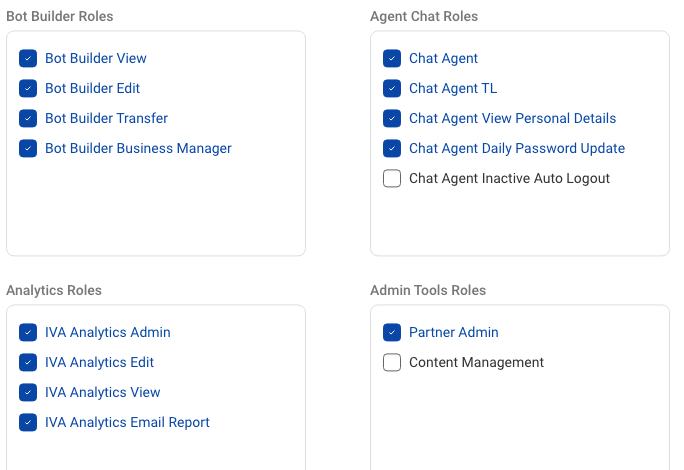
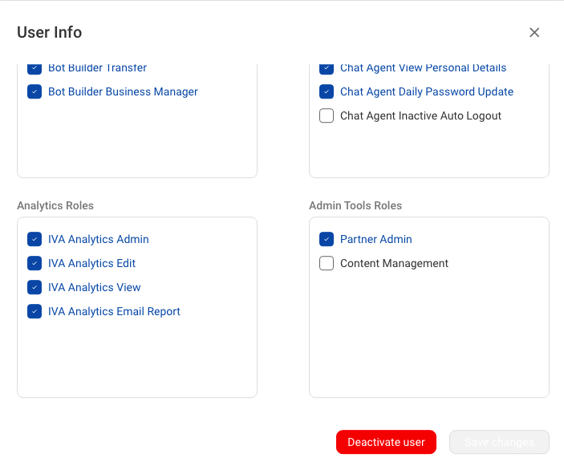

The Permission management tool allows Partner Admins to manage the partners they have access to and provides the following functionality:

* Create New Partner
* Add Existing Users to a partner
* Create New User inside a partner
* Change Roles for the user
* Make Bulk Addition/Updates to the users

> All of the above functionality is only available to a Partner Admin.

## What is a Partner Admin?
A Partner Admin is a special role that can be assigned to someone who needs to manage the access and roles for all users under a partner.

## Available Roles in the System
The roles are divided or categorised on the basis of tools. The available roles in the system are as follows:

* **Conversation Studio**

    * **Bot Builder View** -  This role allows you to view a bot's flows and training data.
    * **Bot Builder Edit** - This role allows you to edit a bot's flows and training data.
    * **Bot Builder Transfer** - This role allows you to transfer a bot to production.
    * **Bot Builder Business Manager** - This role allows you to manage the business configurations and also transfer the business to production.

* **Smart Agent Chat**

    * **Chat Agent** - This role allows you to take and respond to chats from the chat agent tool.
    * **Chat Agent TL** - This role gives you team lead access which lets you manage teams on the chat agent tool.
    * **Chat Agent View Personal Details** - This role allows you to view personal details of the end-user you are chatting to.
    * **Chat Agent Inactive Auto Logout** - This role automatically logs you out after being inactive on the platform for 8 mins.

* **Intelligent Analytics**

    * **IVA Analytics View** - This role lets you access and view all analytics data.
    * **IVA Analytics Edit** - This role lets you view all analytics data and also create/download query completion reports.
    * **IVA Analytics Admin** - This role lets you view all analytics data, create/download/delete query completion reports, and modify columns in the message analysis section.
    * **IVA Analytics Email Report** - This role lets you receive email reports.

* **Admin Tools**

    * **Content Management** - This role lets you manage forms, canned responses and content store.
    * **Partner Admin** - This role lets you manage the users and their roles under the partners you have access to.   

## Creating New Partner

You(Partner Admin) can create a new partner by clicking on the `Create Partner` button on the top-right corner of the screen and then entering the new partner name.

## Adding Existing User

Users who already have an account on the Haptik Platform can be added into a partner by clicking on the `Add User` button and entering their Username. 

**Note**: You will only be able to add a User if you also have access to every other partner they belong to.

## Creating New User

If a user doesn't currently exist in the system, you can create a new user by clicking on the `Create New User` button and then entering the required details in the modal.

## Removing User's Access to a Partner

You can revoke access to a partner for the user by removing the partner tag from the partner selection dropdown in the User Modal which can be opened by clicking on the users listing in the table.

## Assigning or Removing Roles for a Partner

You can assign or remove roles for a user by checking the roles on/off from the user modal.

**Note** : Changes made to the user role apply across the system and not just on the current partner.

## Deactivating a User

You can deactivate a user by clicking on the `Deactivate User` button in the user modal. 

**Note**: This will deactivate the user across the system and not just in the current partner.

## Bulk Updates

You can also make bulk updates by clicking on `Add or Edit Bulk Users` button. This opens a modal that lets you download a CSV file of users for the current partner. You can make edits to the same sheet and upload it back to make bulk changes.
