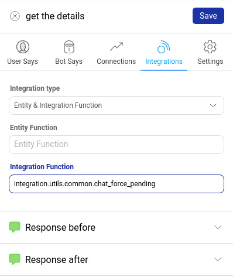

When the user's come to the bot and start conversing, they go through the automated user journeys created using the Conversation Studio tool. When the bot is trained to understand the user's messages, the bot gives correct responses to the user. But when the bot does not understand the user's messages, the bot gives a bot break message. 

When the bot cannot understand the user, you can choose to redirect the user to a human assistant who will help the user resolve their query. 

You can set rule(s) to enable the redirection of users from bot to a human assistant. There are two rules - 
1. Adding Smart Agent Chat integration function on the bot
2. Enabling Human Assistance flag on Business Manager

## Adding Smart Agent Chat integration function on the bot

```
Example use cases - 

1. When the user comes to a bot and explicitly says "I want to chat with an agent".
2. When you want to capture some user details such as their name and email and then redirect the user to an agent.
```

There is a generic function for Smart Agent Chat integration that needs to be added to a node from where the agent function is to be used.

> **integration.utils.common.chat_force_pending**

On the **Integrations** tab of the node, select the type as **Entity and Integration function** and add the below function name in the integration field and then click on **Save**.



Once the users reache the node where you have added the integration function to transfer the chat to an agent, the bot will redirect the user to a [**Team**](https://docs.haptik.ai/agent-chat/teams) on **Smart Agent Chat**.

You need to specify a default Team name in the **Business Manager** section of the Conversation Studio tool. All the agents are a part of Team on Smart Agent Chat. Hence, the chat gets assigned to an agent within the mentioned default Team. 

To provide a default Team, navigate to **Business Manager** via **Open Business** button on the bot page.


> **What is a Default Team?**
> 
> There can be a situation when the team routing logic fails and no team is shortlisted to assign a chat. In that case, the chat is assigned to the default team, set on Business manager.

On the **Business Manager**, in the **General Settings**, select the Team name from the dropdown as shown below - 


> You will need to create a **Team** on Smart Agent Chat. Once you have created the Team, the team name will appear in the dropdown on Business Manager. To know how to create a team, click [**here**](https://docs.haptik.ai/agent-chat/teams).

When the users reach the node where this integration function exists (_get the details_ is the node in the above image), then the chat will be transferred to the Team on Smart Agent Chat.

> Click [**here**](https://docs.haptik.ai/bot-builder/basic/creating-nodes) to know more about creating nodes.

## Enabling Human Assistance flag on Business Manager

```
Example use cases - 

1. When you directly want to redirect the user to an agent and there are no user journeys on the bot.
2. To handle out-of-scope queries of users. The users will be directed to an agent directly.
```

Every bot on the Haptik Platform has a **Business Manager** which contains all the configurations related to a bot. In the **General Settings** section, you can enable the **Enable Human Assistance** flag. 

If this flag is ON for a business, a chat will be moved to an agent whenever the bot doesn't understand the user's message, i.e., instead of responding with a bot break message, the bot will assign an agent to the user to resolve user's query.


> Warning: Before the handover to the agent, the bot might give a [**Smart Assist**](https://docs.haptik.ai/bot-builder/basic/smart-assist) message. In cases where you do not want this to happen, the Smart Assist can be disabled from the backend.

You can combine the rules too, i.e., add the integration function on the user journeys and also enable the human assistance from the Business Manager.

- If a Business is **Bot + Human Assisted** 


- If a Business is **Completely Human Assisted**

_Note: If a Business is **Completely Bot Assisted**, the chat will never be assigned to a team._

Once you have configured the rules to transfer a chat from a bot to a human assistant (also referred to as **agent**), you can start with the Smart Agent Chat setup to handle the incoming chats.
