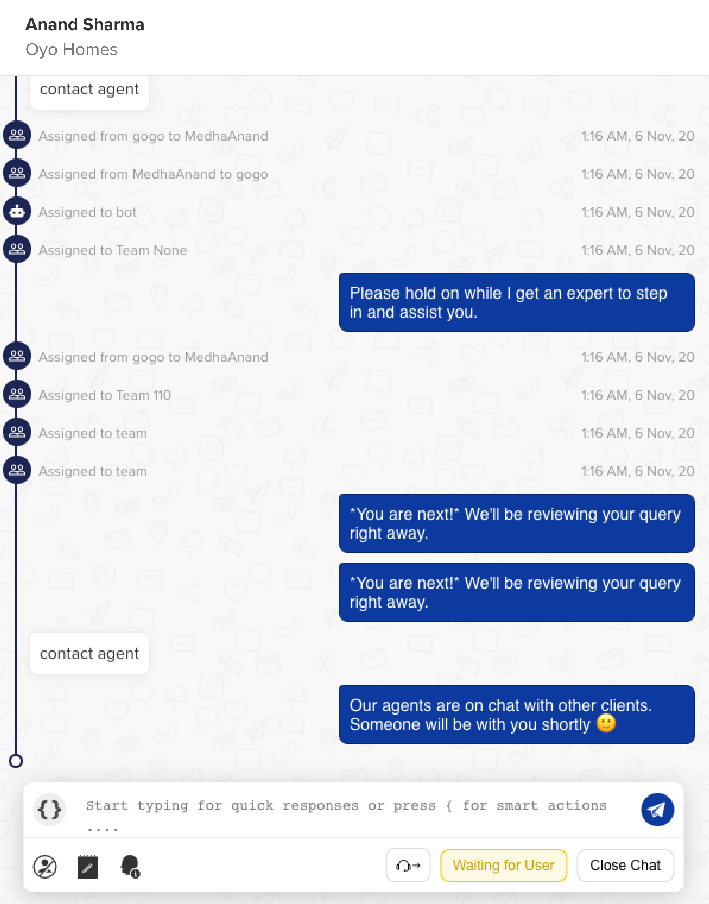
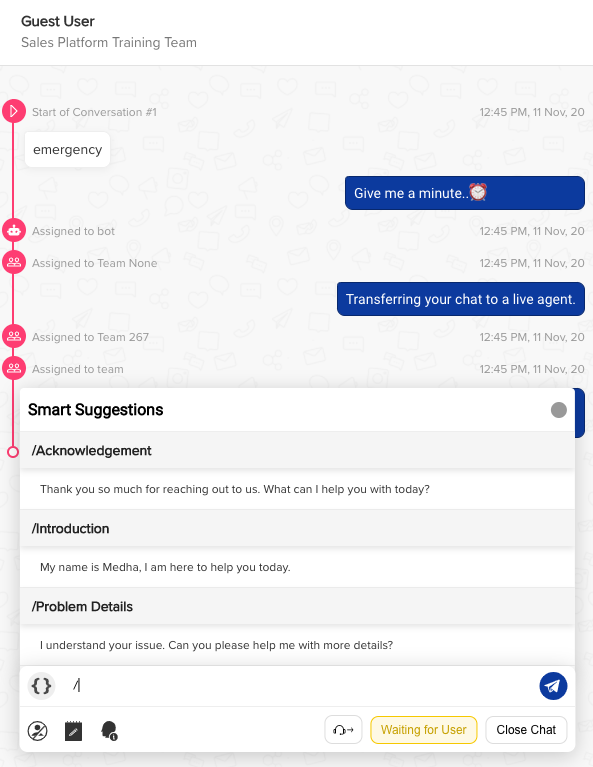
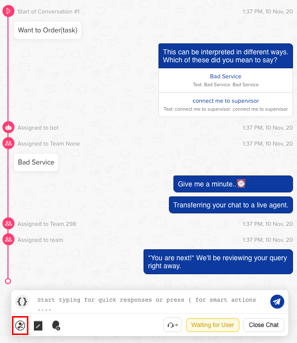
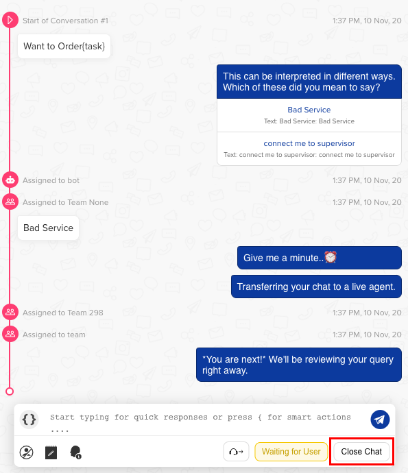
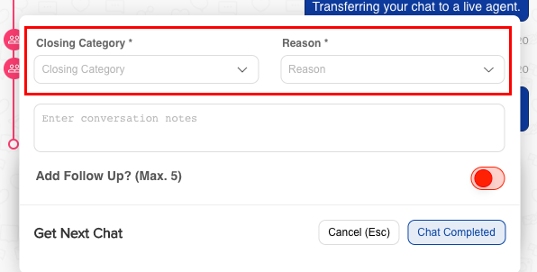
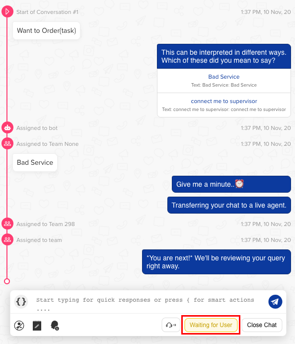
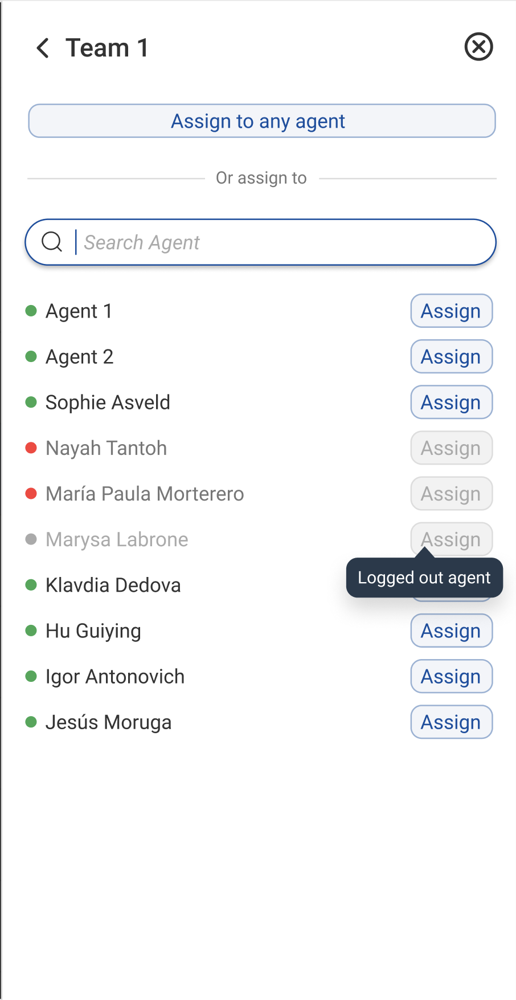

The centre of the screen comprises of the message composer. An agent can - 

  * Exchange messages with the user
  * Send **canned responses** to users
  * Use **Smart Actions**
  * **Report** a user as inappropriate
  * Take down **notes** during a conversation
  * Share a chat link with others
  * Mark chat as **Complete** and **Waiting for user** 
  * **Reassign chat** to a person or a team
  

> When a new chat is assigned to an agent, the agents are able to check the history of the user's conversation with the bot i.e., the messages which user sent to the bot before an agent stepped into the conversation.

## Send messages to the user

Agent can type the responses in the message composer and send them to the user.

## Canned Responses

Canned Responses are predefined responses uploaded prior, which can easily used by agents to reduce response time. They are ready-made responses which agents can customise according to the situation and need before sending it to the user.

## Smart Actions

Smart Actions help the agents to send media attachments to the users. To open smart action, click on the icon at the left hand side of the action toolbar

Once you click on it, below window will pop-up

#### Image Smart Action

Image smart action is used to share an image with the user. The agent can drag and drop the image file on the pop-up that opens on clicking this smart action. You can also add a custom text for the user here. Now, click *Save* and then send it to the user.

#### Attachment Smart Action

Attachment smart action is used to share .pdf files with the user. The agent can drag and drop the file on the pop-up that opens on clicking this smart action. You can also add a custom text for the user here. Now, click *Save* and then send it to the user.

#### External Link Smart Action

Use external link smart action to send links to the user. In *URL* field you have to paste link and in the *Custom Text for User* field, mention about the link provided.

Pasting a link without using the smart action automatically converts it to one without the custom text.

## Toolbar Actions

### Report a user as inappropriate

Agents can mark a user as inappropriate by clicking on this icon as shown below -

We register/log a user being marked as inappropriate once every 2 hours per user. If the inappropriate count for a user is greater than 2, we send a blocked message to the user as shown below -

    Hi <User Name>, this is a system generated message to inform you that your access to 
    this chat service has been permanently disabled. You will not be able to use this 
    chat service any more as you have been flagged multiple times for inappropriate messages 
    sent to our Human assistants.

### Notes

Notes section is used to save link of the product suggested or any other information given from any website. These notes are shared with other assistants for a particular user. It is helpful for another assistant to get the details quickly by just checking notes. Even numbers are saved in *Notes* for reference. Make sure that you save notes wherever and whenever required.

> The user won’t be able to see *Notes* on the app as it is only for assistants.

Please note *Assistant* and *Agent* is the same as the person replying back to the user queries on our chat window.

### User Info Link

This tool will help you to get the link of the ongoing chat. As soon as you click on the tool, it will take you to the next tab where the *User Info* link will be visible. This is used for sharing chat link of users.

## Close Chat

Agents can close a chat by clicking on this button.

As an agent clicks on this button, a modal opens up showing few options like **closing categories** aka disposition tags and **follow up**.

You can read more about closing categories [**here**](https://docs.haptik.ai/agent-chat/closing-categories).

## Waiting for user

As we know, an agent can take only a certain number of chats at once. We call that number **concurrency of chats**. This is specific to an agent. 

Many times we have seen a user stops replying in between a conversation, what shall an agent do in this case? This chat where the user has stopped replying keeps the agent's concurrency bucket blocked. To clear up the concurrency bucket without closing a chat, agents can use **Waiting for user** button. 

When the user will come back and respond on the chat screen, the chat will get reassigned to the agent and the agent can continue the conversation with the user.

This is what makes this button extremely powerful, it cleans up concurrency bucket of the agent at their demand without inserting any friction for the user.

> Note: When an agent is marked offline, all chats that were in "Waiting for user" state are moved back to team queue, and may get assigned to an available agent.

## Reassign chat

In situations where agents need additional help from his team members, they can use this button to reassign the chat to anyone specific among his team or whoever  free in his team. 

Once you click on the **Reassign Chat** button, a modal opens up on the right hand side of the screen where you can choose whom to reassign it to.

1. "Assign to any agent" will auto-assign the chat to an online agent of the team
2. The "Assign" button will be active only if the agent is online, which is indicated by green dot on the left side of agent's name 
3. In case the agent is offline (red dot) or logged out (grey dot), the "Assign" button will not be active and chat's can't be assigned to that particular agent

> When an agent is offline, he would not get the option of **Waiting for user** but only **Reassigning Chat** and **Closing Category** as compared to online state, where agents get to see all controls mentioned above.

