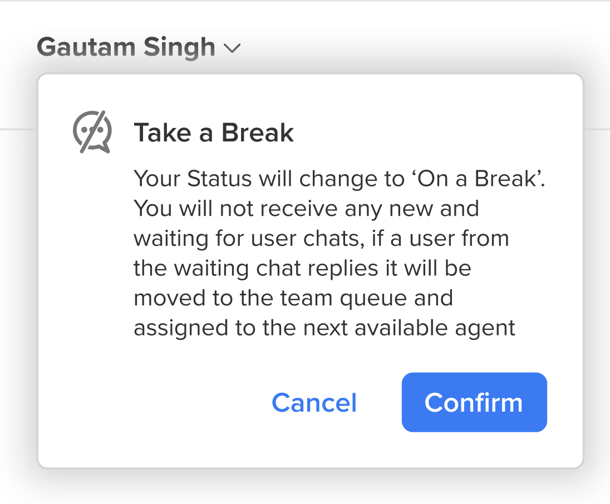
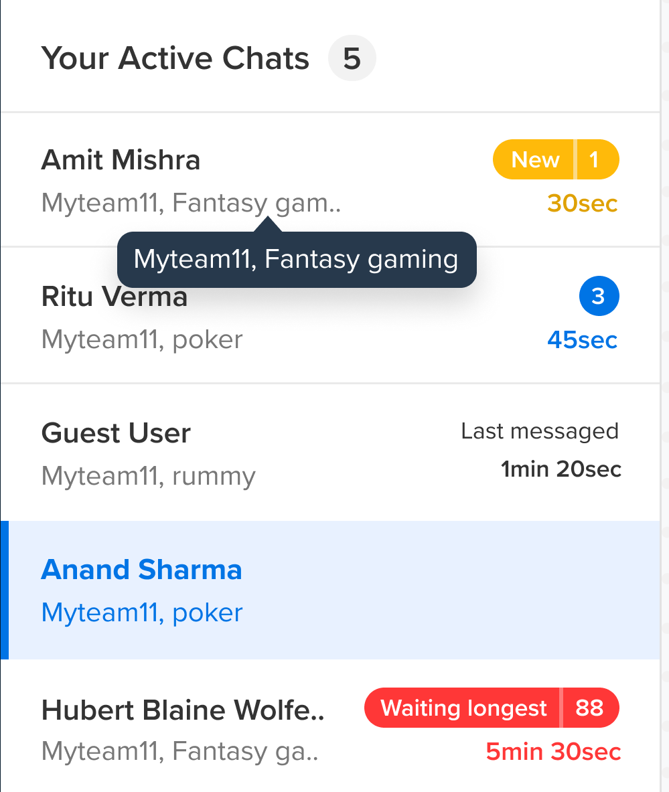
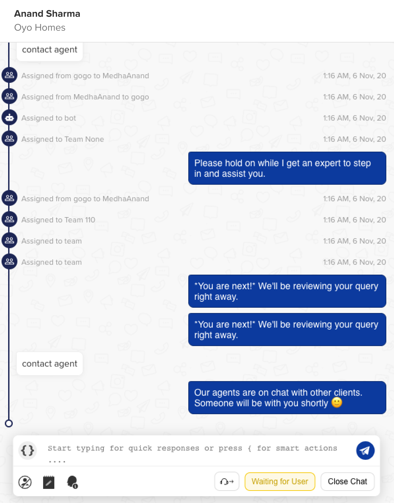
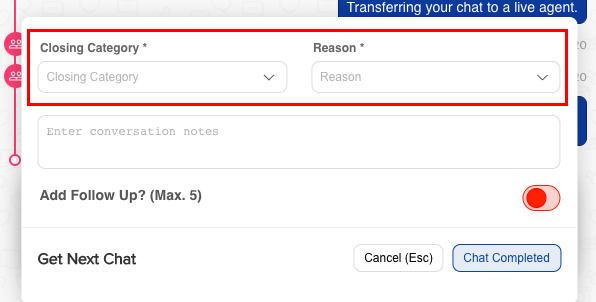
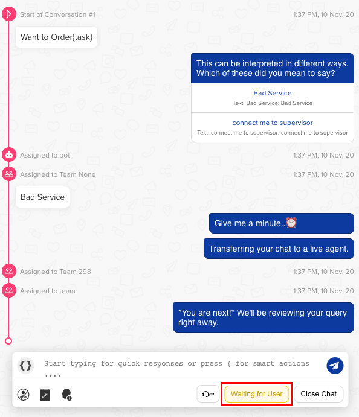
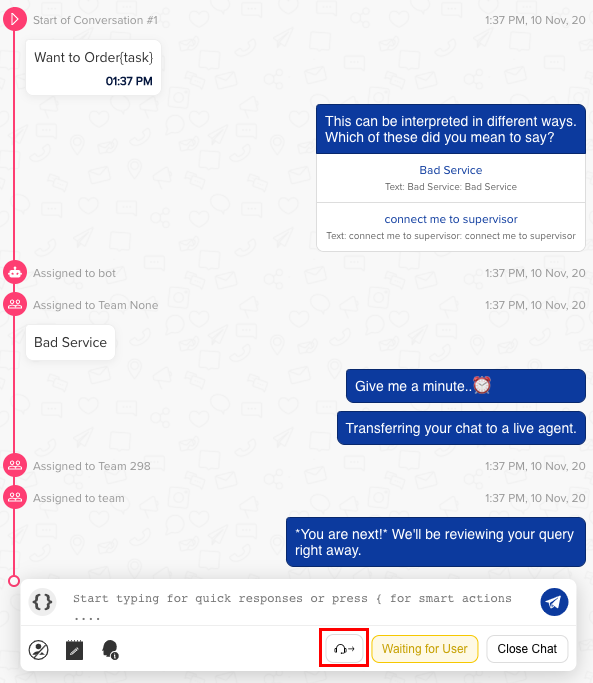
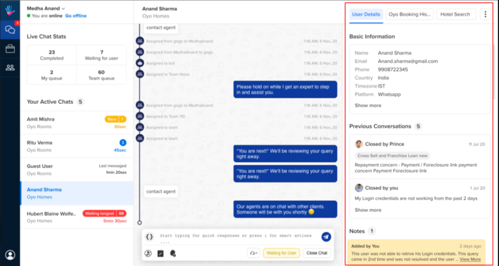
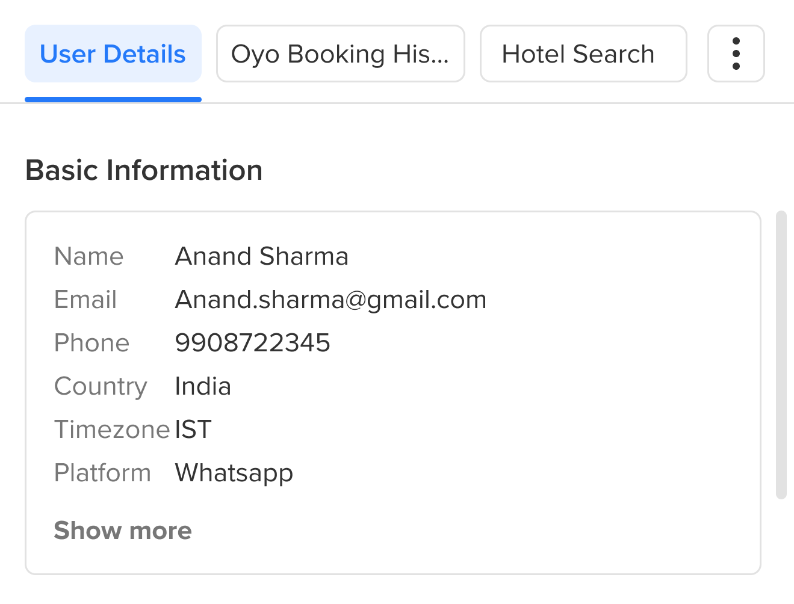
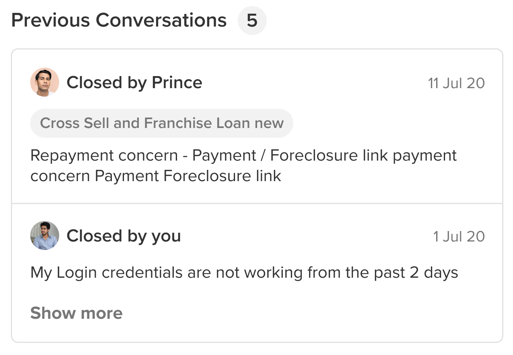

## Logging in

The chat agent gets an email with credentials to the **Smart Agent Chat** tool. 

Using the credentials, a chat agent logs in and clicks on **Smart Agent Chat**. Now, the chat agent can essentially click on the **My Chats** tab i.e. the first option depicted in the left-hand menu.

## How to use My Chats?

In this tab, an agent can start taking chats assigned to him/her personally. The screen is divided into multiple sections. We will call it LHS, Centre and RHS for ease of understanding.

### Left Hand Side of the screen

A chat agent can:
  * View agent's display name
  * View agent's status - Online or Offline
  * View his live chats stats (Completed, Waiting for user, My Queue, Team Queue)
  * View his active chats

#### Agent Details

The agent will be able to view his name and also his current status. 

You can also choose the change the status by clicking on **"Go Online"** or **"Go Offline"**. Before changing the status, a pop up would come to confirm the change.

In the online state ---- WAITING FOR DEEP's TEXT

ONLINE POP UP SCREENSHOT (Tanvi)

> An agent can receive new conversations only in the Online state.

#### Live Chat Stats

This section will provide all numbers related to incoming, existing and completed conversations taken by the agent logged in.

- **Completed**: Number of chats completed today, as per the agent's timezone.
- **Waiting for user**: Number of chats sent in waiting state by this agent.
- **Agent queue**: Chats that have been manually reassigned to the agent and waiting chats where user has sent a response.
- **Team Queue**: Chats that are currently waiting to be taken up by the team. 

> If an agent is part of multiple teams, we show the combined number for team queue.

#### Your Active Chats

This section will show all chats that are currently assigned to the agent.

We show the following details -

- **User name**: This is the name of the user. If the user has provided his name, that would show up or it will be shown as **Guest User**.
- **Team name**: This is the name of the agent's team.

There are few tags which come on the chats depending on whether they have read or unread messages.

1. **Last messaged**: This will come up for read chats where agents have sent a response. 

2. **Message time**: This will either be the first user message time (among consecutive user messages) for unread chats, or the latest agent reply time for read chats, whichever is earlier.

3. **Waiting longest**: This is a tag used for unread chats which have not had a reply for over 5 mins, or the longest waiting chat.

4. **New Chat**: This is a tag whenever a new chat comes in. As its a new chat, its in the unread category.

5. **Number tab**: This is a tag showing the number of messages that the agent has not yet read or responded to. Thus, this is for unread chats only.

**Max number of chats** displayed here would be based on agents concurrent count. 

On click, the chat gets selected in the center page and the tags go away only if the agent replies. Agent can click on chats, but the tag stays the same until the agent sends a message on the chat.

> Agents can use shortcuts like F1,F2,F3,F4,F5 to swap between chats.

### Centre of the screen

A chat agent can:
  * Exchange messages with the user
  * Check history of user's conversation with the bot and other agents
  * **Reassign chat** to a person or a team
  * Mark chat as **Complete** and **Waiting for user** 
  * Use [**Smart Actions**](https://docs.haptik.ai/agent-chat/smart-actions)
  * Take down [**notes**](https://docs.haptik.ai/agent-chat/action-toolbars#notes) during a conversation
  * Report a user as inappropriate
  * Send canned responses to users
  * Share a [**chat link**](https://docs.haptik.ai/agent-chat/action-toolbars#user-info-link) with others

#### Close Chat

Agents can close a chat by clicking on this button.

As an agent clicks on this button, a modal opens up showing few options like **closing categories** aka disposition tags and **follow up**.

You can read more about closing categories [**here**](https://docs.haptik.ai/agent-chat/closing-categories).

#### Waiting for user

As we know, an agent can take only a certain number of chats at once. We call that number **concurrency of chats**. This is specific to an agent. 

Many times we have seen a user stops replying in between a conversation, what shall an agent do in this case? This chat where the user has stopped replying keeps the agent's concurrency bucket blocked. To clear up the concurrency bucket without closing a chat, agents can use **Waiting for user** button. 

When the user will come back and respond on the chat screen, the chat will get reassigned to the agent and the agent can continue the conversation with the user.

This is what makes this button extremely powerful, it cleans up concurrency bucket of the agent at their demand without inserting any friction for the user.

#### Reassign chat

In situations where agents need additional help from his team members, they can use this button to reassign the chat to anyone specific among his team or whoever  free in his team. 

Once you click on the **Reassign Chat** button, a modal opens up on the right hand side of the screen where you can choose whom to reassign it to.

#### Report a user as inappropriate

Agents can mark a user as inappropriate by clicking on this icon as shown below -

We register/log a user being marked as inappropriate once every 2 hours per user. If the inappropriate count for a user is greater than 2, we send a blocked message to the user as shown below -

    Hi <User Name>, this is a system generated message to inform you that your access to 
    this chat service has been permanently disabled. You will not be able to use this 
    chat service any more as you have been flagged multiple times for inappropriate messages 
    sent to our Human assistants.

#### Canned Responses

CANNED RESPONSES SCREENSHOT (Tanvi)

Canned Responses are predefined responses uploaded prior, which can easily used by agents to reduce response time. They are ready-made responses which agents can customise according to the situation and need before sending it to the user.

> When an agent is offline, he would not get the option of **Waiting for user** but only **Reassigning Chat** and **Closing Category** as compared to online state, where agents get to see all controls mentioned above.

### Right Hand Side of the screen

A chat agent can:
  * View User Details
  * Use Custom tools
  * View Previous Conversations
  
#### User Details 

Understanding the basic details of the user like Name, Phone Number, Email, etc, help agents understand the background of the user and help users better. This section gives us all those details about the user.

#### Custom Tool 

Custom tools like ticketing system, CRM, search fields, etc. can be used by agents in this section to solve users queries further, while they continue to have conversations with users.

These external tools can also be expanded for better usability as shown in the image below -

EXPANDED EXTERNAL TOOLS SCREENSHOT (Tanvi)

If there are more than 2 or 3 tools, they will come stacked in a list as shown in the below image -

#### Previous Conversation 

COMING SOON

Depending on the permissions and features assigned to a Chat agent user, more actions could become accessible. 
  
> We also have a system to enforce Data level permissioning i.e. an agent user is allowed to view/edit data for which business can be controlled using this.
