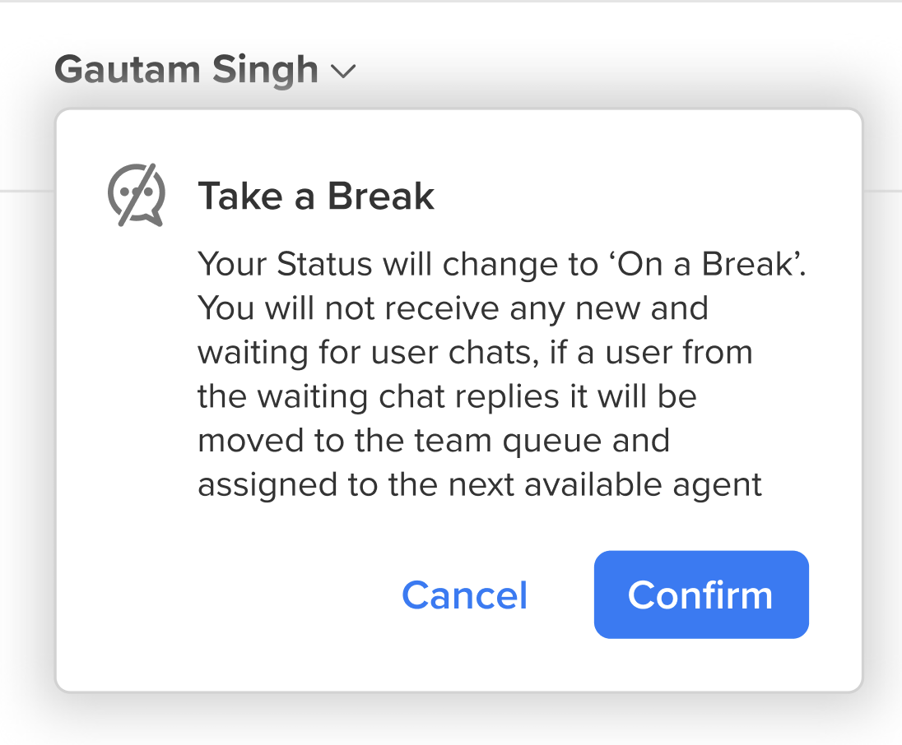
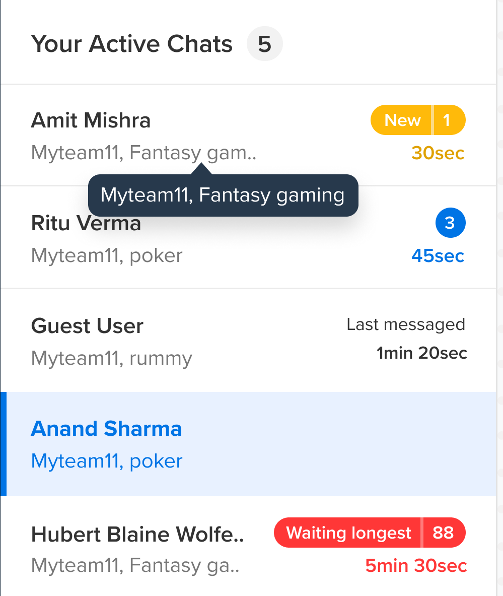

All the live statistics for an agent are present on the left hand side of the screen. This section displays  - 
  * Agent's display name
  * Agent's status - Online or Take a Break
  * Agent's live chats stats (Completed, Waiting for user, My Queue, Team Queue)
  * View their active chats

## Agent Details

The agent will be able to view his name and also his current status. 

You can also choose the change the status by clicking on **"Go Online"** or **"Take a break"**. 

Before changing the status to **Take a break**, a pop up would come to confirm the change.

Before changing the status to online, a pop up would come to confirm the change.

- **Online State**:
When an agent goes online,
  - The agent will start receiving new chats as per his available slots.
  - The agent could re-assign, mark as waiting, or complete any of the chats allocated to him

- **Take a break State**:
When an agent goes on a break,
  - The agent will no longer receive any fresh chats
  - The agent can no longer mark a chat as waiting
  - All chats that were already marked as waiting by him/her will be added to the team queue if the user replies back
  - The agent is expected to wrap up the chats that are already assigned to him

- **Logout State**:
When an agent logs out,
  - All chats that are currently assigned to him/her will be auto completed.

## Live Chat Stats

This section will provide all numbers related to incoming, existing and completed conversations taken by the agent logged in.

- **Completed**: Number of chats completed today, as per the agent's timezone.
- **Waiting for user**: Number of chats currently in waiting state, as marked by this agent.
- **Agent queue**: Chats that have been manually reassigned to the agent either by a fellow team mate or a team lead, or chats that were marked as waiting and the user has replied back.
- **Team Queue**: Chats that are currently waiting to be taken up by the agents of a team, basis their concurrency bucket(slot) availability.

> If an agent is part of multiple teams, we show the combined number for team queue.

## Your Active Chats

This section will show all chats that are currently assigned to the agent.

We show the following details -

- **User name**: This is the name of the user. If the user has provided his name, that would show up or it will be shown as **Guest User**.
- **Team name**: This is the name of the team to which this chat is allocated.
- **Business name**: This is the name of the Business to which this chat is allocated.

There are few tags which come on the chats depending on whether they have read or unread messages.

1. **Last messaged**: This will come up for read chats where agents have sent a response. 

2. **Message time**: This will either be the first user message time (among consecutive user messages) for unread chats, or the latest agent reply time for read chats, whichever is earlier.

3. **Waiting longest**: This is a tag used for unread chats which have not had a reply for over 5 mins, or the longest waiting chat. For an agent, there will always be a maximum of one chat tagged as waiting longest.

4. **New Chat**: This is a tag whenever a new chat comes in. As its a new chat, its in the unread category.

5. **Number tab**: This is a tag showing the number of messages that the agent has not yet read or responded to. Thus, this is for unread chats only.

**Max number of chats** displayed here would be based on agents concurrent count. 

On click, the chat gets selected in the center page and the tags go away only if the agent replies. Agent can click on chats, but the tag stays the same until the agent sends a message on the chat.

> Agents can use shortcuts like F1,F2,F3,F4,F5 to swap between chats.
