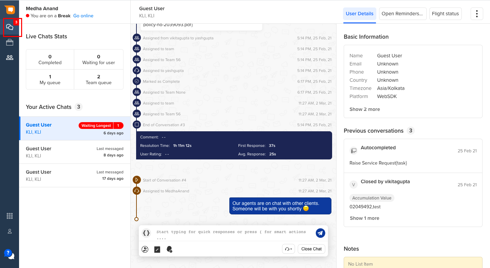

In real-time, agents receive the chats on **MyChats** Page of the Smart Agent Chat. Once they receive the chats they can start responding back to the users. Along with responding back to the user, agents can check the different chats they are handling, agents can raise a tickets in your CRM system and so on.

## How to use My Chats?

In this tab, an agent can start taking chats assigned to him/her personally. The screen is divided into multiple sections. We will call it LHS, Centre and RHS for ease of understanding.

### Left Hand Side of the screen

In the left hand side of the My Chats section, agents can view their status, they can change the status from the top left corner. They can view their chat statistics for the day and also the ongoing chats with the chat status.

> Click [**here**](https://docs.haptik.ai/agent-chat/left-hs) to know more about the live statistics in detail.

### Centre of the screen

The centre of the screen comprises of the main message composer where agents can interact with the users.

> Click [**here**](https://docs.haptik.ai/agent-chat/centre-screen) to know more about message composer in detail

### Right Hand Side of the screen

The right hand side of the screen comprises of user details which were collected from the user on the bot. The agents can also view the user's previous conversations and notes added by other agents with respect to the present user. If there is any external tool added, the agents will be able to see them in the right section of the My Chats page.

> Click [**here**](https://docs.haptik.ai/agent-chat/right-hs) to know more about the user details and external tools in detail.

## Monitoring Chats

The Team Leaders can monitor the incoming traffic and also the chats which agents are handling using - 
1. Team Capacity
2. Monitor Chats on Business and Teams

### Team Capacity

When the agents are handling chats, on the **Manage Agents** section, the Team Leaders (TL) can analyze the real-time incoming traffic and check if they need more agents to come online to handle the incoming chats. 

> Click [**here**](https://docs.haptik.ai/agent-chat/manage-team-capacity) to know more about handling Team Capacity in real-time.

### Monitor Chats

There are two ways you can monitor the ongoing chats or completed chats -
1. From Business
2. From Teams

By monitoring the chats the TLs can check if the agents are handling the chats correctly, you can also analyse the conversations between the agent and the user.

> Click [**here**](https://docs.haptik.ai/agent-chat/businesses) to know more the monitoring chats.

## Notifications and Sounds

Notifications and sounds are sent to agents to increase their productivity. These help to get their attention back. 

Following are the scenarios where we send these notifications and sounds -

### New chat

1. When the agent is on the MyChats screen, a newly assigned chat will be indicated by a sound.
2. When the agent is not on the MyChats screen or using some other application, a newly assigned chat will be indicated by a notification popup accompanied with a sound. 

> The number of active chats will be indicated on the MyChats screen icon.

### New message

1. When the agent is on the MyChats screen and receives a new message from any user, it will be indicated with just the number bubble and no sound.
2. When the agent is not on MyChats screen and receives a message from any user, it will be indicated with a sound and a notification.

