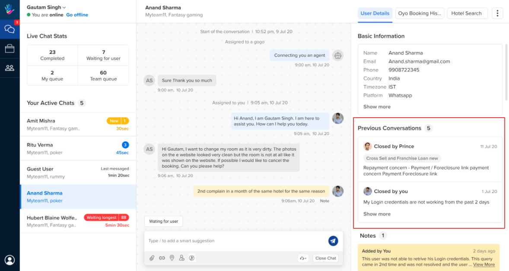
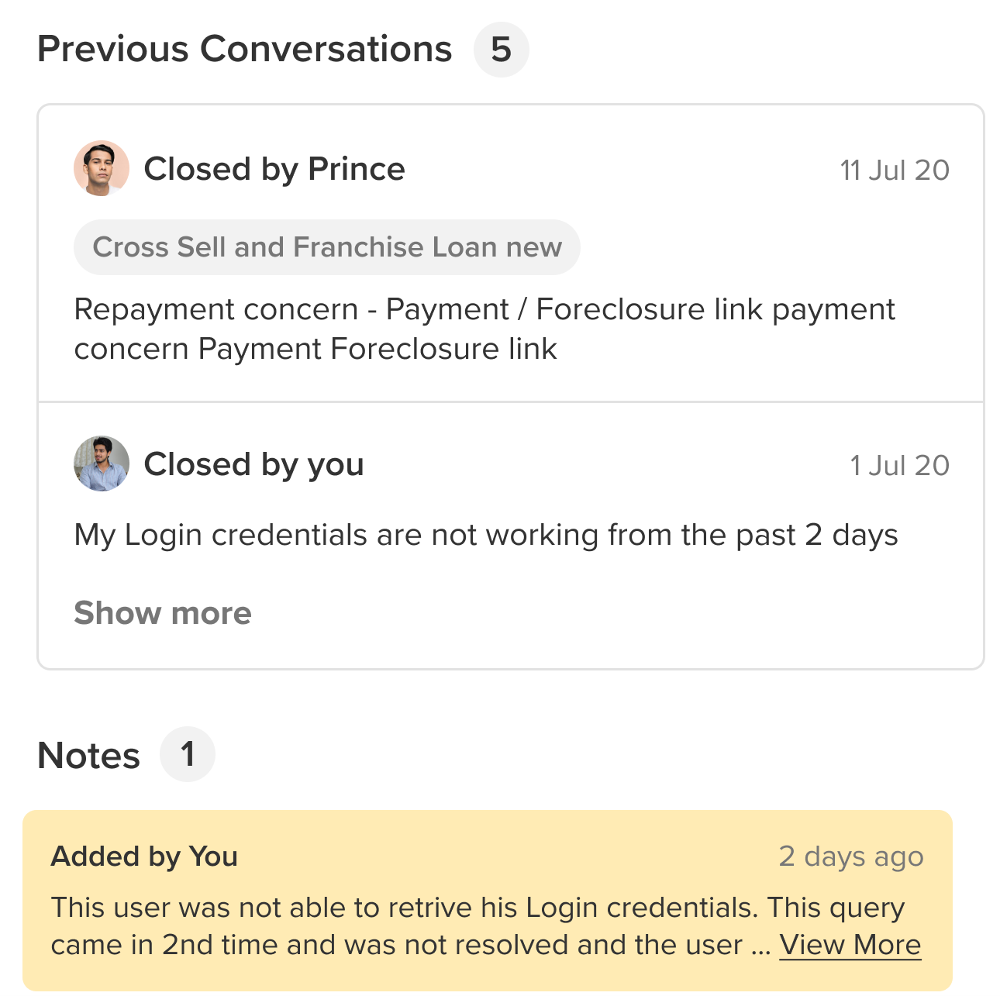
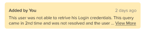
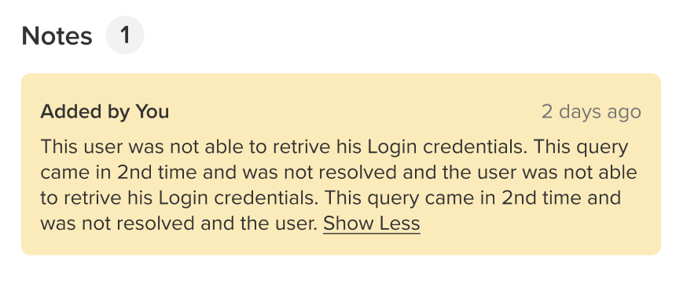
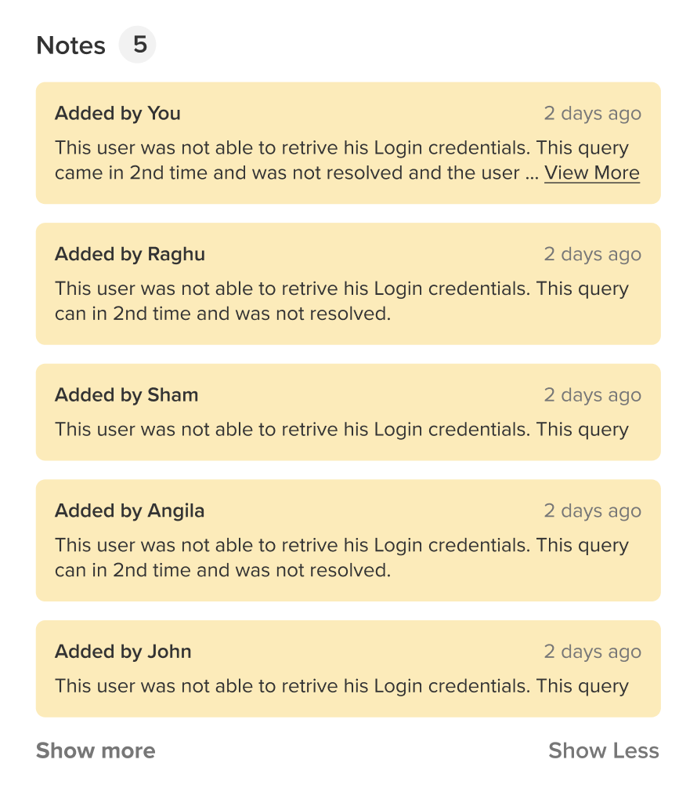

On the right hand screen of the screen, agents can - 
  * View User Details
  * Use Custom tools
  * View Previous Conversations
  * View Notes

## User Details 

Understanding the basic details of the user like Name, Phone Number, Email, etc, help agents understand the background of the user and help users better. This section gives us all those details about the user.

You can read more about this [**here**](https://docs.haptik.ai/agent-chat/adding-user-details).

## Custom Tool 

Custom tools like ticketing system, CRM, search fields, etc. can be used by agents in this section to solve users queries further, while they continue to have conversations with users.

These external tools can also be expanded for better usability as shown in the image below -

If there are more than 2 or 3 tools, they will come stacked in a list as shown in the below image -

Depending on the permissions and features assigned to a Chat agent user, more actions could become accessible. 
  
> We also have a system to enforce Data level permissioning i.e. an agent user is allowed to view/edit data for which business can be controlled using this.

If you want to know how to add a custom tool, you can refer [**here**](https://docs.haptik.ai/agent-chat/adding-custom-tools).

## Previous Conversations

A user might have had multiple conversations with agents at distinct times. **Previous Conversations** section enables the agent to see these latest conversations of the user. A maximum of 5 previous conversations would be shown.

Once the agent clicks on any of the conversations, the chat link opens up in a new tab. The chat link displays the entire history of the chat which user had with the IVA.

Initially, two latest conversations would be present in the **Previous Conversations** section. The **Show more** option allows the agents to view a maximum of 5 previous conversations of the user.

If the user does not have any chat history, the **Previous Conversation** section will be empty and will appear as follows

## Notes

Notes are a stack of all the notes which different agents have recorded while having conversations with the user at distinct times.

The saved note contains the name of the agent who saved the note. If the note goes beoyond 2 lines, a **View More** Button appears. **View More** will expose the entire content of the note. 

When **View More** option opens up the entire note, a **Show Less** option becomes available. **Show Less** option minimizes the open note.

When there are more than 2 notes present, a **Show More** option appears on the bottom on the visible notes. Upon clicking **Show More** all the notes will get displayed in the Notes section.

The **Show Less** option will minimize the Notes content and only display 2 latest notes.
