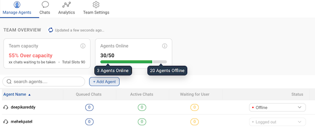

## What is a team?

A team is a group of agents who are trained to handle user queries related to a specific topic. The team can be divided based on the subject matter/location of a user/expertise of agents. The logic for team routing can be defined as per the business requirement. 

## Chat assignment to a team

There are three ways in which a chat can be assigned to a team -

1. Routing a chat from a bot's node
2. Manually assigning a chat to a team
3. Team routing from Business Manager

## How to create a team?

Navigate to **Teams** section of **Smart Agent Chat** tool to create a new Team.

**Step 1 - Provide a Team name**

The team name is used for internal purpose for the Team Leaders & Agents. A user will never be able to see the team name on the chat window.

**Step 2 - Select Team Owner (Client)**

Select the Partner(Client) to which the team belongs.

Click on **Save**. Now your Team has been created. You can select this Team as the **Default Team** in the **Business Manager**.

## How to Manage Agents of a Team?

In the **Manage Agents** section of Team, you can - 
1. Add agents
2. Remove agents
3. View no. of queues, active, waiting for user chats
4. Set chat concurrency
5. View agent status
6. View agent chats

### Add/Remove Agents

In the **Manage Agents** section, click on **Add Agents** button to add agents in the team.

Once the agent accounts have been created on the Haptik Platform, you can search for their username and add them in the team by clicking on the green tick icon. 

**_Remove an agent from the Team_** - 

To remove the agent from the Team, you can click on the delete icon, as shown below - 

### View no. of queues, active, waiting for user chats

You can check the current chats in different states which have been to the agents, once the agents start to receive the chats.

### Set chat concurrency

You can set the chat concurrency for the agents i.e., the number of chats an agent will recieve at a particular moment. If an agent named **gogo** has a concurrency set at **3**, then **gogo** will be responsible to handle 3 different user chats at a given moment of time.

> If **gogo** is a part of **2** different teams and has a chat concurrency of **3** on both the teams, then **gogo** might also receive **6 (3+3)** chats from 6 different users.

The chat concurrency ranges from **1 to 5** and **3** is the default chat concurrency.

### View agent status

You can check if the agents are online or offline from the same section.

### View agent chats

To see the chats handled by a particular agent, you can click on the **View Chats** button, this will redirect you to **Chats** tab in the Teams section.

## How to understand Team capacity?

### Chat handling Capacity and Online Agent slots

The Chat handling capacity for a Team here helps figure the required number for agents at any given instant i.e. for under capacity scenario, the TLs can let some agents go offline. And in case a Team goes over capacity, TLs can call upon agents to be online.

Check the image above. Here, you get 2 values in the Capacity card - 

1. **Chat handling capacity:** This is a %age value that signifies if your team capacity is ideal or your team cannot handle the current incoming chat volume. For example, if the number value is in red and the copy states `over capacity`, it means the chat volume supercedes the available online agents' capacity 

2. **Chats waiting to be taken:** Total number of chats in queue + chats in waiting i.e. all users who might need an agent at any given instant

3. **Total Slots:** Total concurrency of each online agent in the team. Say, if a team had 4 agents with each having a concurrency of 3. The total available slots for the team would be 12. 

> Note: The Online agents' ratio tells you the number of agents online by total number of agents in a given team. 

### How is Team capacity calculated?

Let's understand the formula to get Chat handling capacity by a example -

i. Total concurrency for online agents in the team = A

ii. Queued + Assigned Chats total for all agents in the shown team = B

iii. Availability is calculated as = (A-B) / A x 100

The point `iii` above gives the availability %age value. This value in green means the team can handle the incoming chat volume. 

## How to make changes in the Team Settings?

### **Step 1 - Select a language (Optional)**

If you have multilingual IVA, you can first select the language from the dropdown to configure the following messages.

### **Step 2 - Setup Team Offline message**

If a team status id is defined as offline, the team should configure it. When users send a message and all agents have logged out, you can setup a default message for the end user. For example, this message could say `"Sorry, no agents are available at the moment. We will respond to you as soon an agent is online".`

This message will come when none of the agents assigned to that business is Online. This is also customizable and also we can adjust whether we want to complete the chat in this case or not.

> Ideally, we suggest agents to go offline first and then logout. So, first an agent closes chats in their queue. And then they logout as soon as they're to end their daily shifts. 

There is a toggle of Marking Chat as complete. This means -

- If the Toggle is **ON**, i.e Green colour - All the chats will be completed when agents are Offline.

- If the Toggle is **OFF**, i.e Red colour - All the chats will remain in Pending/Queued State when agents are Offline.

### **Step 3 - Setup Team Delay Message and Delay Time**

Similar to the Team Offline message, you can configure the delay message that is sent to users with a set delay time. This message will be sent to the user when all agents are busy will other chats. This is customizable and we can adjust the time after which this message will be sent.

> Note: Offline message will appear immediately after the user has initiated an agent chat, whereas Delay Message will appear after the specified time interval.

### **Step 4 - Setup User Recall Message and Recall Time**

Similar to the Delay message, you can configure the recall message to get the user back in the conversation. This message is sent once the chat has started with the agent but the user has stopped replying in between to the Agent. The time can be configured between 0s to 8m. 

After making all the adjustments, Don't forget to Save all the changes which you have done.

## Managing Offline Hour chats

In the Team settings, you can turn the toggle to complete all chats when no agent is online. But there can be an edge case as mentioned below. We need to understand when this edge case occurs, and assign a specific permission to all agents.

A chat would get assigned first to the last agent who took this user's chat. Assuming the agent is available. We mandate agents to go offline before 30 minutes of their shift closure time, and then logout on shift end. This works in sync with our assignment so that logged out agents are not considered for assignment. For when agents are going offline, but not actively logging out, the chats that come in offline hours get assigned but the agents in reality are not available. We should use the `Inactivity_logout` permission that logs out agents on no activity for 15 minutes. 
