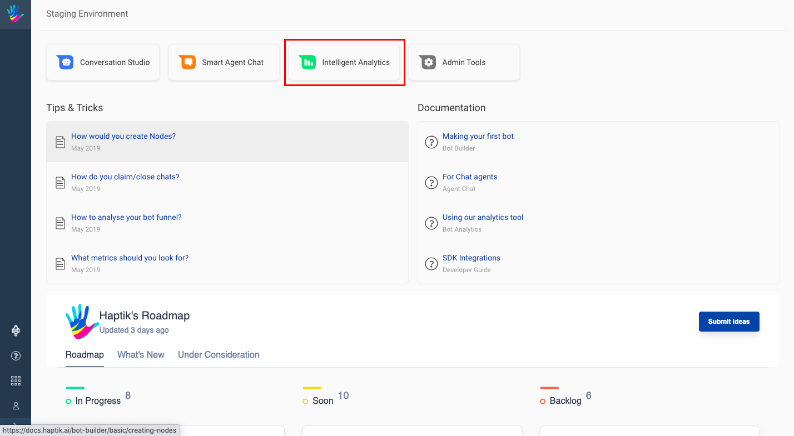
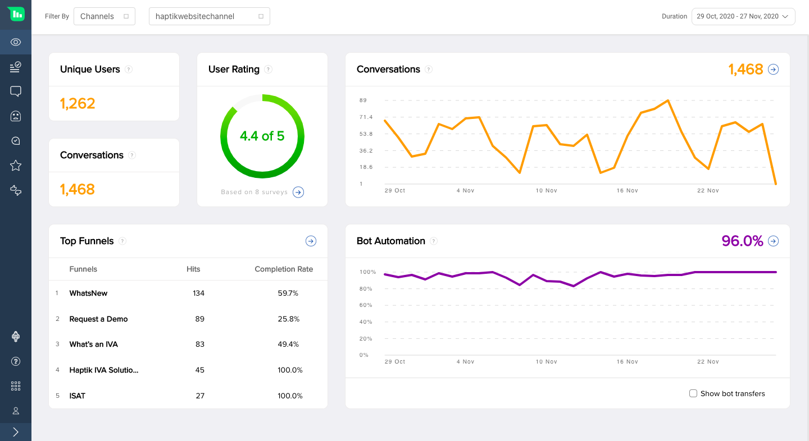

Intelligent Analytics by Haptik empowers teams to get a comprehensive overview of how the IVAs are performing. Get in-depth insights into how users interact with your IVAs, identify problem areas or features that can be improved and also collect first-hand user feedback about your IVA experience in real-time. The user messages/conversations with historical data can help answer the toughest questions about users. Boost your IVA's conversations' success with this tool.

This tool consists of multiple sections with each section containing metrics and data about a different aspect of the IVA. The multiple sections include:

- Overview
- Story Analysis
- Message Analysis
- AI Recommendations
- Word Analysis
- Smart Funnel
- User Ratings
- User Reviews

Through this document, we shall explore the different types of metrics available for tracking and analyzing the IVA using the real-time Intelligent Analytics tool. You can go through the below introductory video of **Intelligent Analytics** to take a birds eye-view of the tool.

<iframe width="560" height="315" src="https://www.youtube.com/embed/lgCipCKobxg" title="YouTube video player" frameborder="0" allow="accelerometer; autoplay; clipboard-write; encrypted-media; gyroscope; picture-in-picture" allowfullscreen></iframe>

## Getting Credentials
The first step in starting to use the Intelligent Analytics tool is to get the credentials from the Haptik team.

Haptik team will provide you with a username and password over email. Also a url will be shared, using which you can access the tool.

## Accessing the Tools
Once you have the credentials the next step is to open the url provided by the Haptik team. After you open the link you will be asked to enter your credentials. You can use the credentials provided by the Haptik team to login to the site.

Below is the home screen you will get to see once you have successfully logged-in.

## Opening Intelligent Analytics
After you have been presented the home screen with all the tools you have access to, click on the `Intelligent Analytics` option to open the analytics tool.

After clicking on `Intelligent Analytics` you should be able to see the analytics dashboard with a menu to open different parts of the tool.

Now that you can access the tool, you can go through the sections provided in this documentation to know more about the various screens on `Intelligent Analytics` tool. You can start [**here**](https://docs.haptik.ai/bot-analytics/overview).

## Tool Tips

In every section of the tool, there are tool tips available right below the name of the section which will help you understand how can you make use of the data present in that section.

