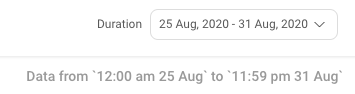
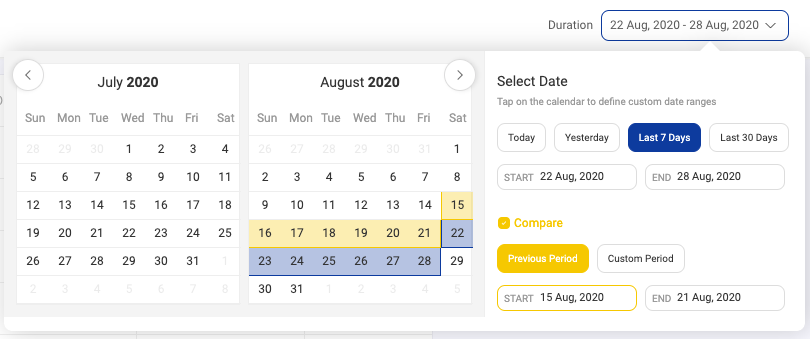
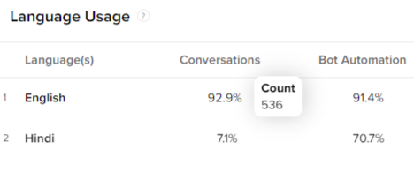

## Introduction

The first section in the `Intelligent Analytics` tool is the **Overview** section. As the name suggests, this section helps you get a quick overview of the important metrics to measure the IVA's performance.

The **Overview** section provides information about:

* Unique Users
* CSAT
* User Rating
* Conversations
* Top Funnels
* Bot Automation
* Language Usage
* Conversation Split

> You can know more about a section by clicking on the  icon and  icon will take you to their respective sections on the Intelligent Analytics tool.

### Business Name

On top of all screens inside the Intelligent Analytics tool you will find the business options. This option helps you select the business name from the dropdown for which you want to analyze the data.

### Timezone

The tool will identify your timezone to analyze the data.

### Duration

On the right hand side of the filter section, you will find the duration filters. Using these settings you can filter the time period of the data presented. 

There is a compare feature available which will help you to compare the performance of all metrics between the selected duration and its previous duration.

## ***Unique Users***

The first section in the overview section is the number of users who have conversed on the bot in the given duration period. On hovering the number, you will be able to check the actual number of **new users** and the number of returning users i.e., **repeated users**.

## _CSAT_

CSAT Stands for _Customer Satisfaction Score_. This key performance indicator tracks how satisfied are the customers are with service.

_**How is CSAT Calculated?**_

> CSAT Formula = Positive responses (4 and 5) / Total no. of response volume

For example, if you have 35 positive responses (4 and 5) and a total of 50 responses, your CSAT would be 70%.

There following colours are used to show the benchmarks of CSAT - 
* **Green** - 80% and Above
* **Orange** - 70-80%
* **Red** - Below 70%

## ***User Rating***

This section gives the average User Rating. The rating is optional and is given on a scale of 1-5 stars.

## ***Conversations***

A conversation is defined as a series of messages exchanged between the IVA and the user before 8 minutes of inactivity.

- **Bot state**

In bot state, we close a conversation when there are no messages exchanged between the IVA and the user for 8 minutes. 

- **Agent state**

In agent state, we close a conversation either only when the agent clicks “Close Chat” or after 8 mins inactivity for chats that are in “Waiting State”.

> Automated system messages like "Chat Assigned", "Chat Completed", "Delay", "Follow Up" etc. are not to be included when calculating the conversation complete time.

In the graph, the X axis represents selected time range and the Y axis represents conversations count. 

You can view data by hovering over the graph at the selected point of date-time. 

- **Traffic**: It will give the number of unique users and conversations.

- **Bot Performance**: It will give the Bot Automation %.

- **Funnels**: It will give the top queries asked by users.

- **User Rating**: It will give the average of user ratings given.

## ***Top Funnels***

This section gives first 5 funnels as per volume coming on the bot.

> Funnel is a step or a series of steps designed to see the effectiveness of the bot to help user’s reach their goal.

Along with the funnel name, funnel hits and completion rate are also shown.

> **Funnel Hits**: Defines the number of times a particular funnel has been hit by all the users on the bot.
>
> **Completion rate**: Defines the number of instances where the user reached their end goal.

## ***Bot Automation***

The next section is Bot Automation. Bot Automation percentage tells us about what percentage of the conversations did not have either a bot break or an agent involved for the selected duration of time.

In the graph, the X axis represents selected time range and the Y axis represents Bot Automation %. 

> **Bot Automation Formula** = No. of conversations did not have a bot break or have an agent response / Total no. of conversations

Below are the scenarios where bot breaks could possibly take place -

**Scenario 1**:When a bot fails to answer a query which it was trained on

**Scenario 2**:When there is an API failure and the bot is not able to give an appropriate response

**Scenario 3**:When a conversation gets transferred to an agent from a bot

> When bot gives a smart assist message, it is not considered as a Bot Break. You can read more about Smart Assist and its types [**here**](https://docs.haptik.ai/bot-builder/basic/smart-assist).

As we do not count Smart Assist as a broken message. In case you want to access these messages, you can follow below steps

- Click on the Message Analysis section
- Use the Confidence Score toggle to find the below messages
  1. 0-30 for Bot Break and Smart Assist messages
  2. Above 30 for all other messages
  

You can view data by hovering over the graph at the selected point of date-time. 

- **Traffic**: It will give the number of unique users and conversations.

- **Bot Performance**: It will give the Bot Automation %.

- **Funnels**: It will give the top queries asked by users.

- **User Rating**: It will give the average of user ratings given.

### Bot Transfers

Bot Transfers are shown on the graph too with a vertical line along with a toggle filter to see the details with and without. Checking these lines on the graph will help us understand if there have been any changes in the bot's performance due to bot transfers.

## Language Usage

**Language Usage** shows the split of languages, conversations and bot automation percentage for all the languages user are interacting in, on the IVA. This section helps in understanding capabilities that should be added to support end-users who reach out in different languages.

**What does language(s) mean?**

This section helps in understanding split of different languages your users are interacting in with the IVA.

> If a user talks in a language which is not enabled on the bot, the bot will give a bot break and it will be tagged under default language **English** and automation number for English will be affected.

**How are conversations calculated under Language Usage?**

Conversations shows the split of languages in which the users are interacting with the IVA.

**Formula = No. of conversations (in that language) / Total no. of conversations X 100**

The message which was spoken by the user towards the end of the conversation is considered as the language in which the user interacted with the IVA. If in the conversation, the first half of the conversation is in English and the rest is in Hindi, the conversation counter would go up for Hindi as the last message was in Hindi.

When you hover over the Conversation %, you can see the conversation count as shown below -

**How is bot automation calculated under Language Usage?**

**Formula = No of conversations (in that language) that didn’t have a bot break or agent response/Total number of conversations (in that same language) X 100**
