## Introduction

For a business which has deployed an IVA solution, it is imperative to know if the IVA is being able to resolve users’ queries i.e. when users are asking questions, is the IVA able to respond with appropriate responses and not requires a human intervention.

**Smart Funnel** helps us track how users navigate across different nodes and end up getting their query answered. In other words, it indicates the effectiveness of an IVA. This feature will play an important role to enhance our user journeys and IVA content. Various metrics like completion rate, drop-off rate, drop-off nodes, and funnel hits help us achieve the same.

> Nodes are interlinked building blocks of an IVA. Each node takes care of one intent coming from the user and responds appropriately.

All these funnels are visible for the duration and business/IVA you have selected on top. Also you can use the **Compare** feature to make comparisons for your IVA's performance between the selected duration and previous duration.

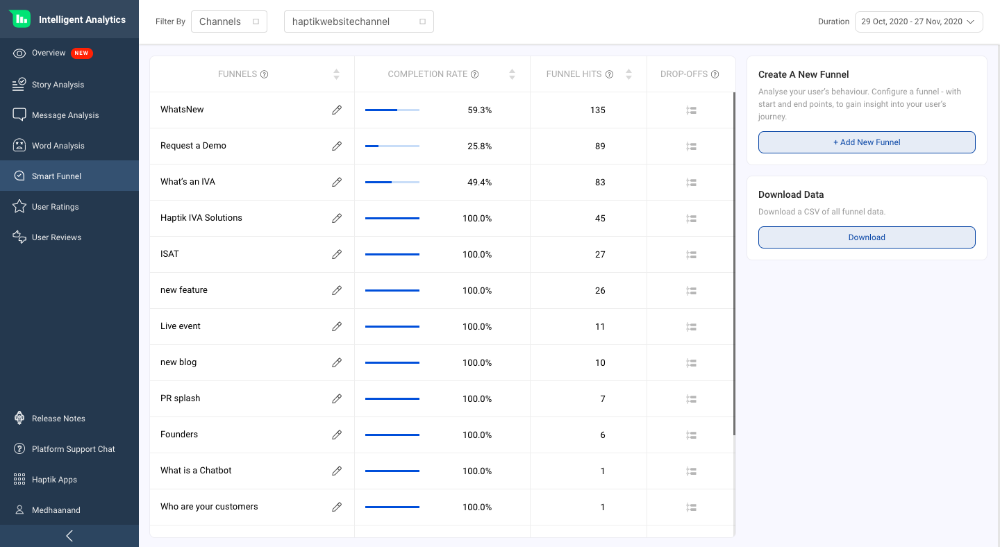

## Funnels

A funnel is a question or a request for information by a user. On Intelligent Analytics tool,  it is a step or a series of steps designed to help user’s reach the end of the flow that gives them the appropriate answer.

For example, a user interacts with a banking assistant and wants to check their account balance. In this case the funnel name will be “to check account balance”.

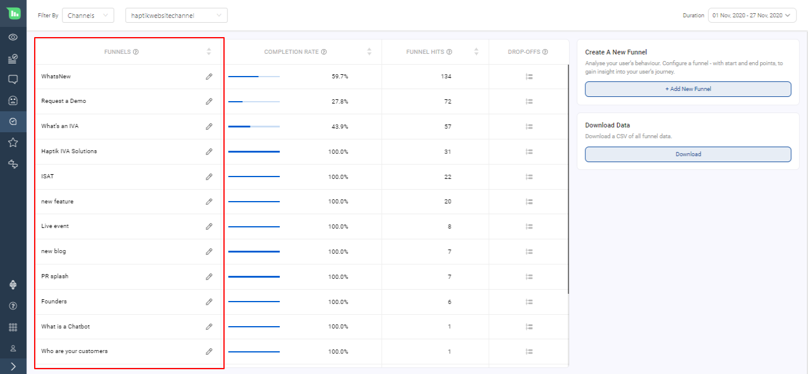

## Creating Funnels

You can create your own custom funnels depending on which IVA usecase you want to track. You can click on **+ Add New Funnel** as shown below.

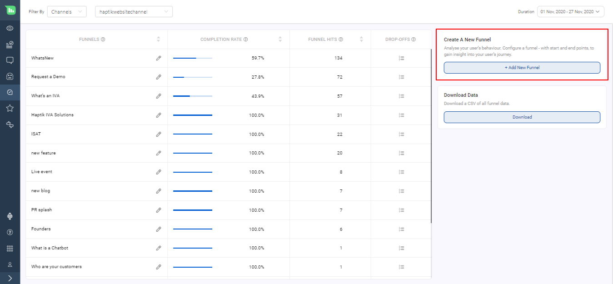

A funnel has two parts to it.

- **Funnel Start**: User asking for account balance

- **Funnel End**: IVA’s response with the account balance

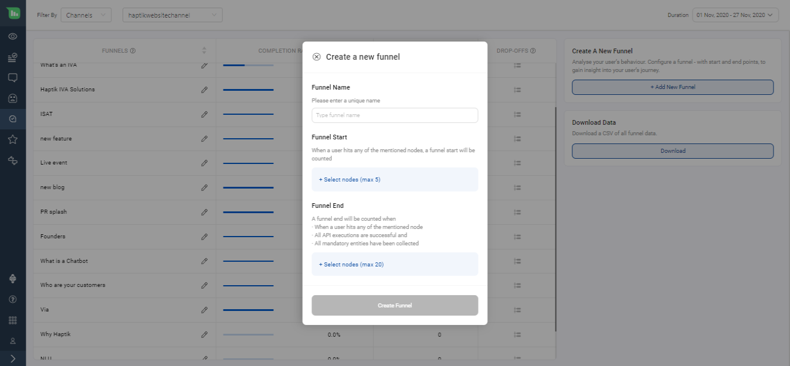

You can specify up to

- **5 start points**: a set of nodes denoting the beginning of a Funnel (Funnel Start). A start point has to be unique for every Funnel i.e. multiple queries cannot have the same start point.

- **20 end points**: a set of nodes denoting completion of the Funnel (Funnel End).

You can keep adding nodes by clicking on the **+** button as shown below

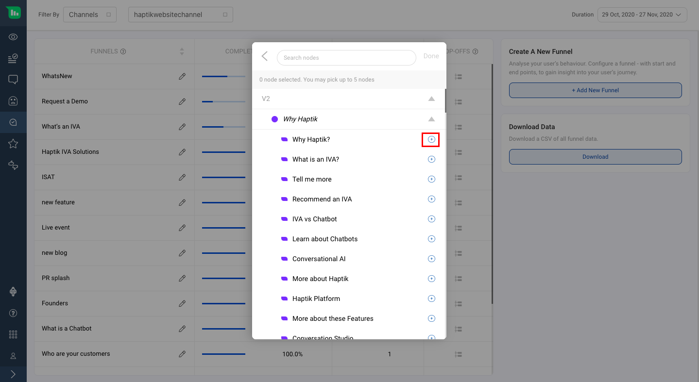

For example, if you’d like to track a funnel of checking account balance the start point could be the node that captures the intent of checking account balance. The end points could be 2 nodes - one that disburses ‘current account balance’ and the other that disburses ‘savings account balance.’

You can also search for nodes on this window as shown below

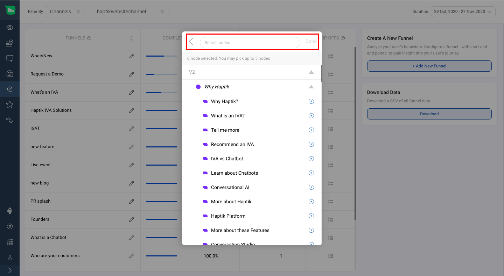

Once you are done selecting the nodes click on "Create Funnel" as shown below

> You need to be mindful while creating a new funnel and choosing the start and end points of those funnels keeping real life user messages under consideration as these funnels will help you gauge the effectiveness of the IVA.

## Editing Funnels

You can edit the names of your funnels by clicking on the pencil icon in front of any funnel as shown below

> Providing appropriate names to your funnel is very important. The name should define what your funnel is tracking.

## Completion Rate

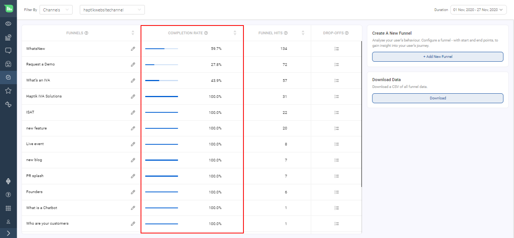

This indicates the effectiveness of the IVA design and flow as it shows what were the funnels that were completed by the IVA

Formula =  (A / B) * 100

A = Number of instances where the user query reached the end point and all conditions are met
B = Number of instances where the user started his journey for a particular funnel

i.e. Formula =  (Total no. of funnels completed /  Total no. of funnels initiated) * 100

**Conditions that need to be met for a funnel to be counted as complete**

- The user must have arrived at any of the start points
- All API executions through the flow must be successful
- All mandatory entities through the flow should have been collected
- The user must have arrived at any of the end points

For example, if your account balance funnel contains node A, B, C, F, G, H, and you’ve set up a funnel with start points as A, B & end points as G,H, here’s how funnel start and end will be calculated:

## Funnel Hits

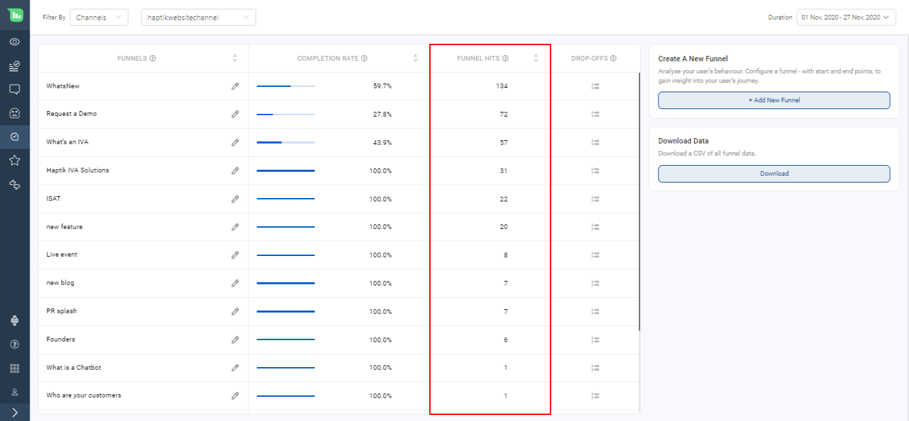

This is the no. of times the start point of a funnel has been visited by the user.

Scenario 1: If a user visits the same start point sequentially we do NOT increment the funnel start count

**Example:**

Funnel Path: A -> C

User Session: A -> A -> A -> C (END)

Result: Funnel1 completed (Here repeated counts of A are not counted as new funnel start)

Result: Funnel Hit -> 1.

Scenario 2: If a user visits the same start point twice but not sequentially we increment the funnel start count

**Example:**

Funnel Path: A -> C

User Session: A -> B -> A -> C (END)

Result: Funnel started at A and user went to B. User restarted the funnel at A and completed the funnel by reaching C.

Result: Funnel Hit -> 2

## Sorting of Funnels

By default, you will see the funnel with the highest Funnel Hits on top. This is done in order to quickly check the completion rate of the most visited query.

If required, you can change the order of other fields and sort it as per your requirement.

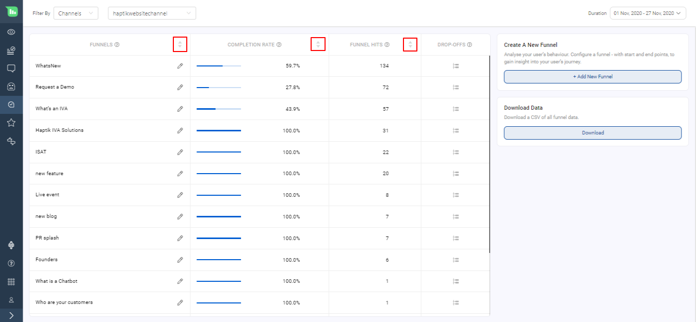

## Drop Off

To understand why a funnel was not completed, it’s important to know points at which the users are abandoning, restarting or diverting to a different flow. Understanding of WHY the funnel is not reaching its completion can be found in the drop off section. The insights on messages shared between the IVA and the user along with the Drop Off Nodes can help tweak the conversation design and flow to optimise for better results.

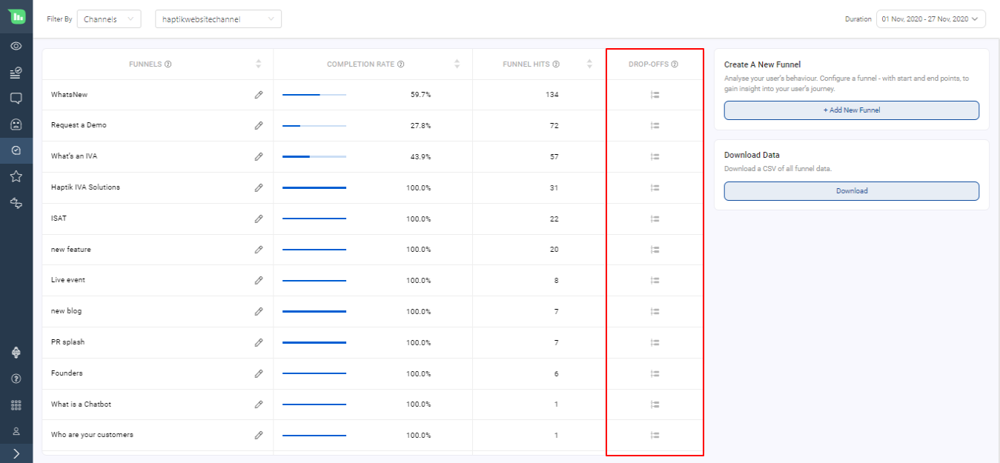

### How are Drop-Offs calculated?

A user could abandon a conversation due to any of the below reasons. The last visited node is marked as the drop-off node under all of these scenarios:

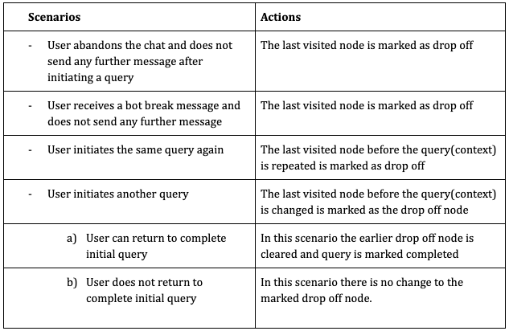

Below are some scenarios which explain drop off in more detail.

**1. Diverted**

If a conversation is diverted from one funnel to another, a drop off is counted for the first funnel.

**Example**:

F1: Node A -> Node C

F2: Node B -> Node E

**User Session**: A -> D -> B -> X -> E

**Result**: F1 started on A and diverted to F2 on D. So there is a droff off on D for F1 and F2 got completed.

**2. Restarted**

If a new funnel is restarted in between another funnel, a drop off is counted for the first funnel.

**Example**:

F1: Node A -> Node C

**User Session**: A -> D -> A -> X -> C

**Result**: Two funnels initiated. So there is a droff off on D for F1. Again, F1 restarted on A and got completed.

**3. Abandoned**

If a conversation is abandoned by the user, a droff off is counted for the funnel.

**Example**:

F1: Node A -> Node C

**User Session**: A -> X -> D

**Result**: There is a droff off on D for F1 as the user abandoned at D.

**4. Agent Transfer**

If a conversation has an agent handover, a droff off is counted for the query.

**Example 1**:

F1: Node A -> Node C

**User Session**: A -> D -> X -> (Agent chat assigned)

**Result**: There is a droff off on D for F1 as the chat got assigned to an agent.

**Example 2**:

F1: Node A -> Node X

**User Session**: A -> D -> X (all entities collected) -> (Agent chat assigned)

**Result**: F1 got completed as all the entities are collected.

> When any funnel definition is changed, the drop offs for all other queries will need to be recalculated.

### Drop-Off Points

To check the drop-off points for a funnel, you can click on the icon as shown below

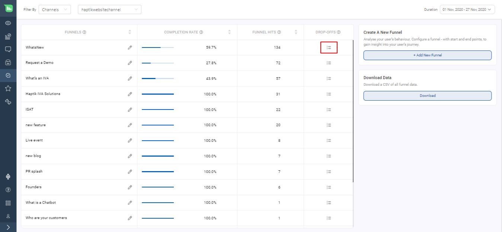

A screen would open on RHS. This screen will have all details of drop-off with the following

- Node Names
- Percentage distribution of drop-off
- Responses sent from IVA and its variations

> We do not show type of nodes under Drop Off Point

Following are the drop-off points under a Node which will be shown

- Bot Says and its Variants
- Entity Responses and its Variants
- Final Response and its Variants
- Entity re-prompt message: Message content would not be available for this
- Integration Response Message: Message content would not be available for this
- Follow-up Message: Message content would not be available for this

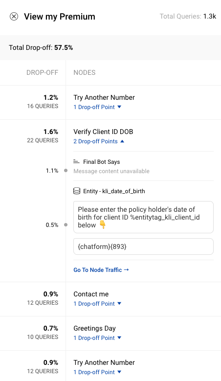

**No Node Detected** is shown in the following conditions

- When no nodes were matched as per User says
- When a Smalltalk node is matched

## Deleting Funnels

You can delete your funnels by clicking on the pencil icon in front of the funnel and **Delete button** on the modal as shown below

> We have a separate permission for deleting a funnel so that the access to delete funnels can be given to the required memebers of a team.

## Download Report

You will be able to download the Funnel Completion data. It will be available from 10th September on the dashboard. This report will help you understand the reasons of the drop-off in your funnel.
