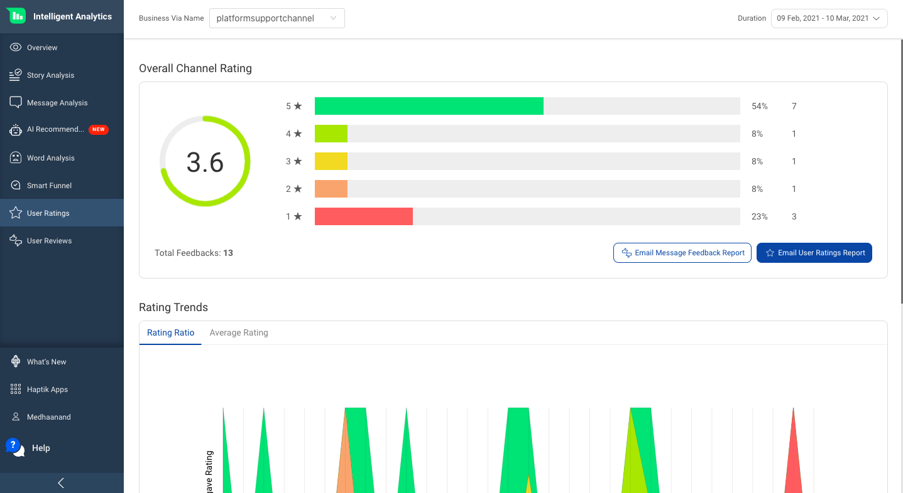
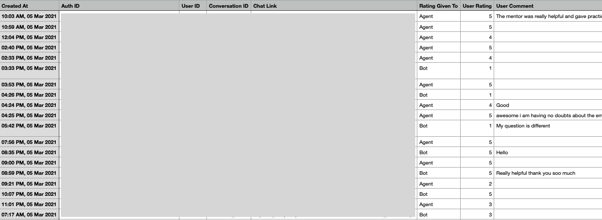

## What are User Ratings?

The User Ratings page of the Intelligent Analytics tool provides information about the ratings given by a user for a bot and agents(if present). 

Based on the configuration made by the bot developers, a bot might ask for feedback from user at the end of a chat. The feedback it captures involves a star rating out of 5 and a free form text review or comment. 

> **Tip**: The configuration to take user feedback can be made from the `General Settings` tab of the `Business Manager` section in the bot builder tool.

You can filter the ratings based on Channels or Bots and for any date range from the top navigation bar.

## ***Overall Channel Rating***

At the top of the User Ratings page you have the Overall Channel Rating. The Overall Channel Rating gives you a high level view of how your bot was rated overall.

In the left corner of this section you can see the average star rating provided by all users. Next to it you can see the total number of people that have given a particular number of stars. For example you can see how many users gave 5 stars, how many gave 4 stars and so on. You can find both the percentage and absolute number of users for any feedback. 

There are two options of emailing feedback report here.

### Message Feedback Report

There is an option to collect feedback on every message sent by the bot for free form queries. You can enable the settings for **per message feedback** on **Business Manager**. 

On Intelligent Analytics tool, you can email this feedback report by clicking on this button on User Ratings screen. 

### User Ratings Report

To differentiate ratings received by the bot and agents(if present), you can email this User Ratings report by clicking on the button highlighted on the below image and you will receive a password protected CSV report over email. 

The CSV report has a dedicated column **Rating Given To** to specify who received this rating - Bot or Agent.

## ***Rating Trends***
Below the Overall Chat Ratings you have the Rating trends where you can see how the user ratings varied over time.

On X axis you have the time and on Y axis you have the total number of users that have given the rating. There are two graphs available here.

### Rating Ratio
The first graph present in the Rating Trends section is called Rating Ratio. Here an area graph is used to show the split of users giving different levels of ratings over a period of time.

The legends at the bottom of the graph show you the color relating to each of the different rating levels.

You can get more detailed information about the user ratings at any given time by hovering on the graph.

### Average Rating
The second graph is the Average Rating where instead of showing the trend of all the levels of rating, you can see the trend of average rating over a period of time.

At the bottom of the graph you can see a legend explaining that the red line indicates the average rating given by the user.

Similar to the previous graph you can view the specific average rating at any point of time by hovering on the graph.

## ***Task Performance***
The final section in the User Ratings page of the Intelligent Analytics tool is the Task Performance section. 

In this section you will find data of how each task in the bot performed. The table shows the list of all tasks and the average rating that task received along with the number of people who provided feedback. It also provides links to all comment reviews that were given for the task.
