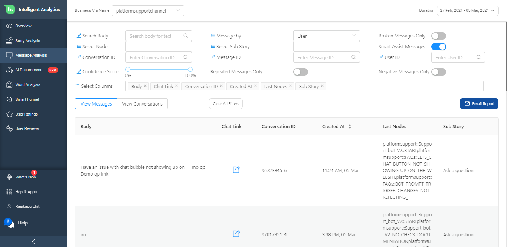
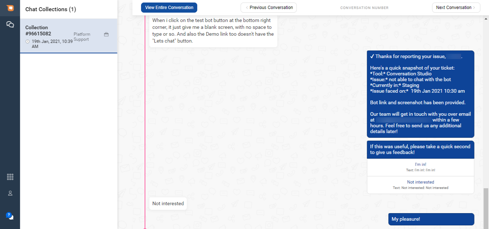
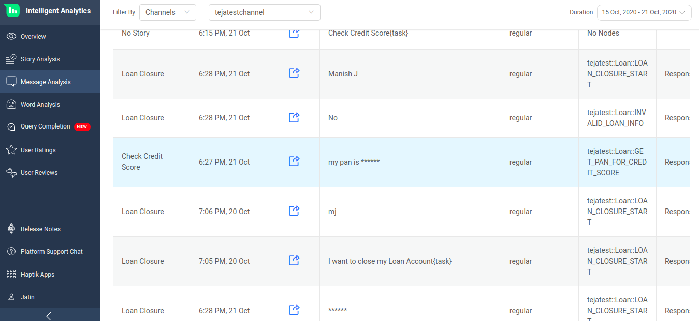
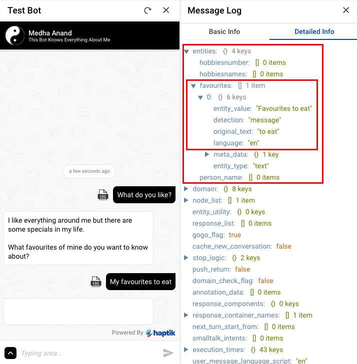
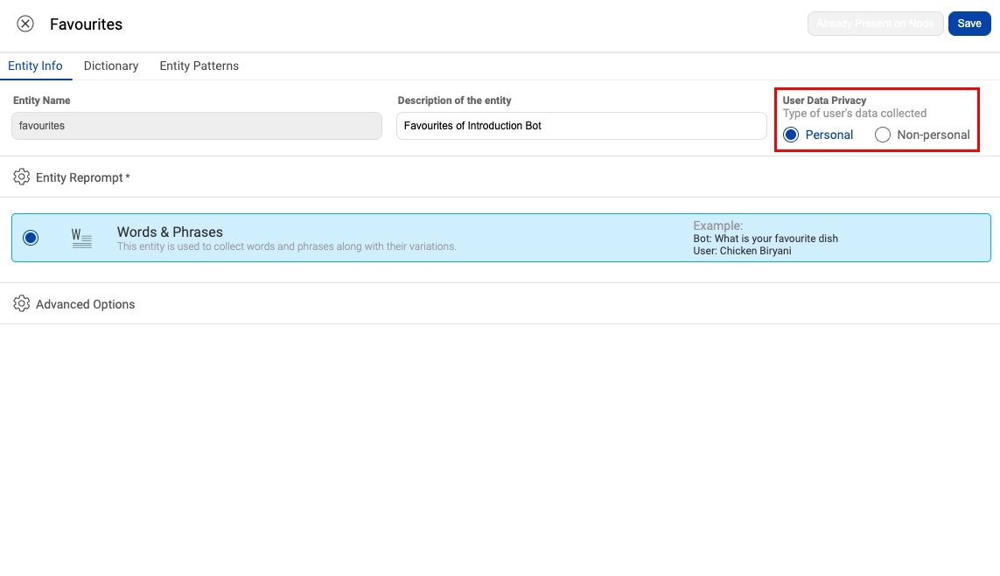

In the Intelligent Analytics tool you can go to the "*Message Analysis*" section to analyse the bot performance at a message level.

You can start by selecting a specific channel or bot and setting the time period. And then you should see a page with options to filter and analyse the messages sent and received by your bot.

The top half of the page consists of multiple filters. We will go through each of these filters and understand how they can be used later in this document.

Below the filters you have a table of data where you can see the messages processed by clicking on the `View Messages` link. Or you can choose to see the conversations of your bot by clicking on the `View Conversations` link.

> Tip: A conversation is a set of messages processed to perform a task.

The data in the tables are paginated and you can scroll to different pages of the table by using the navigation icons below the table.

## View Messages
The View Messages section of the page which can be accessed by clicking on the `View Messages` link above the table. The table shows data about the messages processed by your bot.

The columns of the table can be configured by you in case of Viewing Messages. We will discuss these configurations in a later [section](#select-columns). But by default the tool selects a few columns for you.

These columns are:
* **Body** - This column shows you the actual message that was sent.
* **Chat Link** - This column provides a link to open and view the entire conversation related to the message. 

Clicking on the link will open a page that shows the conversation as well as the user details which were collected on the bot. There is a **Previous Conversation** and **Next Conversation** button to help you navigate throughout the various conversations of the user. If you have access to both **Smart Agent Chat** and **Intelligent Analytics**, you will be able to the chat link as shown below - 

  

> Read more about chat links, [**here**](https://docs.haptik.ai/bot-analytics/chat-links).
  
* **Conversation ID** - This is a unique ID every conversation has.
* **Created At** - This column tells you when the message was recieved by the bot.
* **Full Name** - This column shows the full name of the user who sent the message.
* **Last Nodes** - This column shows the last node that the user was on before sending this message. This information can be useful to understand what the context was for the user sending the current message.
* **Sub Story** - This column shows which Sub Story the node from **Last Nodes** column belongs to.

## View Conversations
The View Conversations section of the page which can be accessed by clicking on the `View Conversations` link above the table. The table shows data at a conversation level, rather than at a message level.

In case of viewing conversations the columns of the table are fixed and they are:
* **Last Node** - This column gives you information about the previous node before the user started the current conversation. This information can help you understand the context of the current conversation.
* **Chat Link** - This column provides a link to open and view the complete conversation. This is similar to the chat link in the View Messages table.
* **Full Name** - This column provides the full name of the user who was part of the conversation.
* **Time of Creation** - This column provides information about when the conversation started.
* **Total Number of Responses From** - This column provides a overview of the sources of the different messages in the conversation.
    1) User - This section tells you how many messages of the conversation came from the user.
    2) Bot - This section tells you how many messages of the conversation came from the bot.
    3) Assistant - This section tells you how many messages of the conversation came from a human agent.
    4) Others - This section tells you how many messages came from other sources. These could include notifications, reminders, feedback messages etc.
* **Broken Messages** - This column gives you information about how many messages broke in the conversation. A message is considered to be broken if the bot cannot respond to it.

### Downloading the report
There is an option to email the Message or Conversation data in CSV format if needed. This can be done by clicking on the `Email Report` button above the table showing the data.

The CSV file will be sent to you on the Email address registered with your account.

## Filters
As mentioned above, the Message Analysis page provides you with many filter options. You can use these filters to select what data you see in the Conversation/Message table on the page.

In this section of the document we will go over each of these filter options. We will see how you can use one or a combination of these options to select the data you view in the tables.

### Search Body
The first filter option is `Search Body`. You can use this option to filter the table based on the message body.

For example you can filter for all messages containing the words `I want to book a Ticket` by entering it in the `Search Body` input field and then clicking on the magnifying glass icon inside the input field.

The above will give you all the messages similar to the phrase you searched for. For example, results with "I want a ticket", "I want to book a flight ticket" etc. will also be shown in the results.

However, if you are interested in exact match only, then you can enclose your phrase within double quotes `"`. For example, `"I want to book a flight ticket"` will show only those messages with the exact string being present.

> **ProTip:** If you want to search for an exact phrase, enclose it within double quotes like this `"<search phrase>"` when searching.

### Select Nodes
The next filter option is `Select Nodes`. This option allows you to filter by the nodes (static and output nodes).

This is a dropdown field. You can click on the field and the dropdown options should show the different nodes in the bot. You can pick one of the nodes from the list and the table will be filtered to only data relevant to that node.

### Conv ID
The next filter is `Conv ID`. This filter lets you see data related to a particular conversation. You can enter the conversation id of the conversation you want to view the data for in the input field and click on the magnifying glass icon to filter the data.

### Confidence Score
The next filter we will look at is `Confidence Score`. This option lets you filter messages that the AI was able to categorise by the degree of confidence configured by you.

The `Confidence Score` is a draggable option where you can set a range of confidence scores rather than a specific confidence score.

### Message By
The message analysis page also lets you filter the data in the table based on the source of the message. You can use the dropdown option to select the source which can be one of:
* All - Shows all messages.
* Bot - Only shows messages sent by the bot.
* User - Only shows messages sent by the user.
* Assistant - Only shows messages sent by the chat agent.

### Select Sub Story
This option lets you filter the data based on which sub story on the bot builder the conversation or message belongs to.

### Message ID
This option lets you filter based on the Message ID. You can enter the Message ID of the message you want to see in the input field. Then on clicking the magnifying glass icon in the input box the data should get filtered.

### Broken Messages Only
This option lets you switch betweeen seeing only all the messages that lead to a bot break.

### Smart Assist Messages
Intelligent Virtual Assistants are always trained to cater to user queries that fall within a fixed scope. However, at times, customers might ask queries that don’t fall within the scope of the IVA. This tends to prevent the IVA from answering the User’s queries.

A key component in Haptik’s conversational experience is SMART ASSIST. The objective of the component is to respond back to the user smartly when the IVA is not able to completely understand the User’s query. This should open up the pathways for the users to reformulate or redirect their queries, so that appropriate response can be given. To know more about Smart Assist click [**here**](https://docs.haptik.ai/bot-builder/basic/smart-assist).

This option lets you see those messages that triggered the Smart Assist layer.

### User ID
This option lets you filter the data based on the user id. This can be helpful to understand the messages/conversations of a partcular user.

You can enter the user id you want to filter by inside the input field. Then on clicking the magnifying glass icon, the data should be filtered.

### Select Columns
The final option we will be looking at is the `Select Columns` option which lets you filter what columns are shown in the View Messages table.

The columns that you can select from are:
* Confidence Score 
* Conversation ID 
* Created At
* Full Name
* Last Nodes
* Message ID 
* Source Language 
* Sub Story
* Total User Messages 
* Translated Messages 
* User ID

> Note: If you apply filters on a column that is not selected the data will still be filtered.

### Clear Filters
Apart from the filter options, you also have a button to clear all filters you have applied.

> Note: When you apply multiple filters, it is possible for the filters to cancel out each other or overlap each other. In such cases you might not see any data or see unexpected data. In such cases it is useful to use this button to clear all filters.

## Data Masking

Personal information in a conversation needs to be protected when a conversation is marked as complete. This includes User Says, Bot Says, Agent Messages, Media, etc. We mask or encrypt this personal information in order to protect it. Data masking is the practice of intentionally randomizing anonymizing specific data/information to secure it. 

Data on **Message Analysis** screen will show up in the masked format. If you download the **Message Analysis report**, then that will also show up with the masked version. However, chat links will show up in their original form. 

The masked data is shown as **6 asterisks** in a message as shown below -

### What all gets masked? 

Not everything needs to be protected but sensitive data like phone-number, email-id, account number, date-of-birth, etc. needs to be protected. In most of the cases, these values are inserted as **entities**. So we essentially need to mask these sensitive entities.

We mask the **original_text** not **entity_value**. In a few scenarios, the original_text and entity value are different. The current masking rules consider only the original_text. In the below image, it is shown how **original_text** and **entity_value** can be different -

The following policies, in order of priority, are triggered sequentially.

- Personal Entities
- Predefined Masked Entities on the platform
- Predefined Regex Patterns on the platform

#### Personal Entities

Entities which are marked as **Personal** on the Conversation Studio tool are masked in the conversation. It is shown in the below image where you can mark an entity as Personal -

#### Predefined Masked Entities on the platform

Few entities are considered as **personal** at the platform level. Once they are detected in conversations, they are automatically masked. This list is not editable and is defined at the platform level. Currently, only one entity is under this list -

- phone_number

#### Predefined Regex Patterns on the platform

Some data is considered as **personal** using **Regex Patterns**. Once they are detected in conversations, they are automatically masked. This list is not editable and is defined at a Platform level. Currently, the below regex patterns are used for this -

- **r_email** - \b[A-Za-z0-9\.\+_-]+@[A-Za-z0-9\._-]+\.[a-zA-Z]+\b
- **r_numbers** - \b\d{6,16}\b
- **r_pancard** - \b[A-Za-z]{5}\d{4}[A-Za-z]\b

### Enable Data Masking

Data masking will be enabled by default for all new partners being created. If you wish to switch off the Data Masking (Data Encryption) flag, you can do the same from the Partners List under Admin Tools as shown below

We do not recommend disabling Data Masking. If you do, then please explicitly inform the same among all stakeholders.
