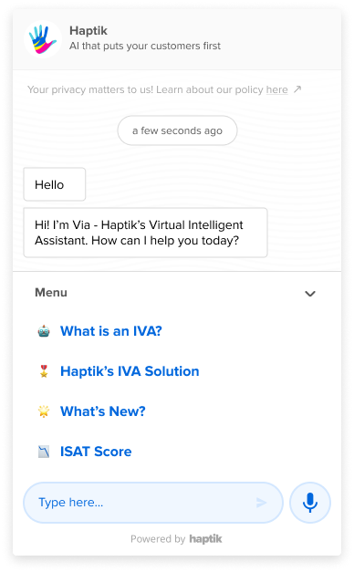
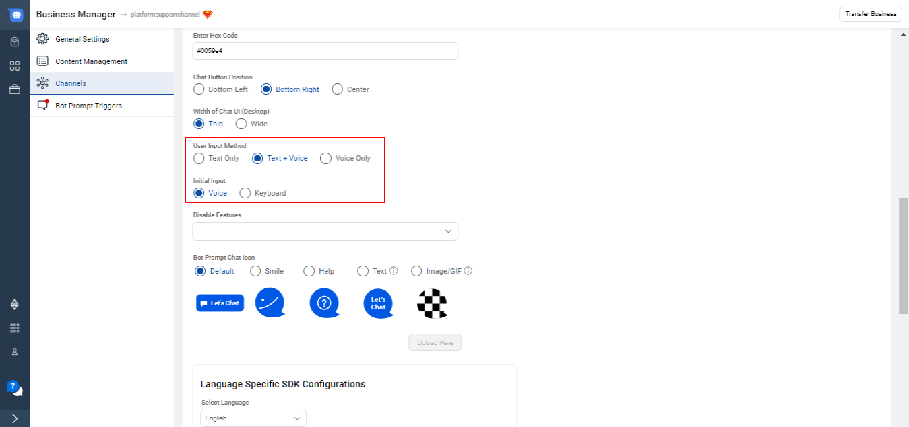
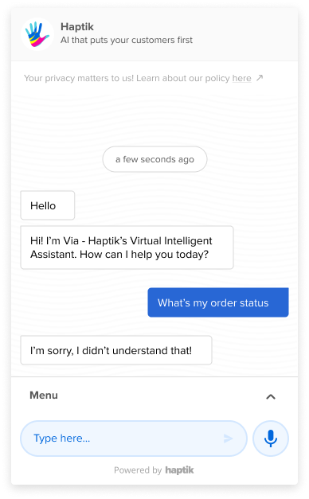
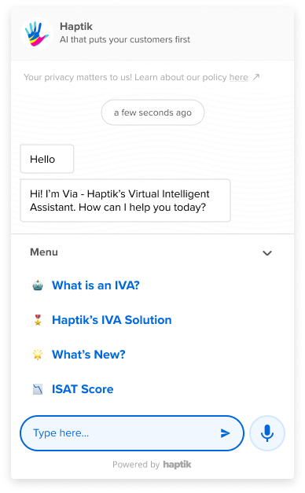
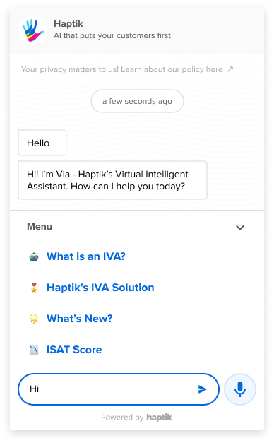
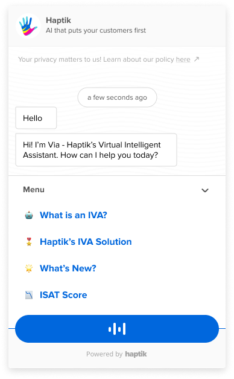

## What is a Voice IVA?

Voice is an efficient mode of communication because of its speed, accuracy and effortless measures. A voice IVA diminishes the user's attempt to type-out a message and leads them to have a hassle-free conversation with the IVA. 

A voice IVA primarily uses voice/audio as an input for communication. Once the voice option is enabled for the business, you can see the mic icon on the IVA as follows



When the user clicks on the mic icon, the IVA captures the audio from the user and converts it into text. This text becomes the user input and then the IVA responds accordingly.

## How to build a Voice IVA?

There are few steps to enable voice on your IVA. These are explained below in detail.

**Firstly**, the business needs to be configured to accept voice input. Under **Channel** page of **Business Manager**, enable the **Text + Voice** user input method, as shown below.



> **Warning: Initial Input field is being deprecated**

Once this is configured, you should be able to see the mic icon on the IVA.

**Secondly**, to configure audio responses on a voice IVA on Conversation Studio, go to a node to set voice-specific bot responses. 

On a node, you can tap on **+Add a chat element** in Bot says. Once you click on it, a slide bar opens on the right-hand side. Click on the preferred chat element. Here for your element, you can configure the response via two fields:

1. **Bot Says**: This is the response which will be sent as a text to the user.

2. **Voice Says**: This is what the IVA says out loud i.e. the output from your device speaker. You tap on **+Voice support** and add message details.

> **Note: Voice Says is not supported on the Raw Text/JSON element.**

It will look as shown in the image below


### Enabling Auto Mic option

Once a bot response is sent, the user has to click on the mic icon to send a new message. When we enable the **Auto Open Mic** option, after the bot response is sent, IVA opens up the mic automatically and user can send their message. This makes the IVA more user friendly.

Note - If changes are made in Bot says, you have to save the data to test the IVA. If changes are made in User says, you will have to save, then train the IVA and later you can test the IVA.


### Using SSML Tags:

Let’s suppose you have to add various voice features such as emphasizing the tone on a specific sentence or spell out a word to the user, you can make use of SSML tags in such instances.

SSML tags are to be added in the Voice Says field box as shown in the image above. 

For understanding how SSML tags are to be added, check the syntax details below -

1. Adding a break

`<speak> Not sure. <break time="2s"/> Please reach out on our email-id. </speak>`

As per the SSML tags used above, after Bot says "Not sure." there will be a break time of 2 seconds and then IVA speaks the rest. 

2. Adding emphasis

`<speak> You can contact us on <emphasis level="strong"> our landline </emphasis> on weekdays. </speak>`

As per the SSML tags used above, after Bot says "You can contact us on" there will be emphasis on "our landline" phrase and then IVA speaks the rest of the text.

You can use the following SSML tags while adding Voice Says:

- effect: This can be used to enhance the volume of certain sounds in your audio file.

- emphasis: This can used to emphasize words. Emphasizing words changes the speaking rate and volume.

- p: This can be used to add a pause between paragraphs in the text.

- phoneme: This can be used for phonetic pronunciation for specific text. 

- s: This can be used to add a pause between lines or sentences in your text. 

- lang: This can be used to specify another language for a specific word, phrase, or sentence.

- sub: This can be used with the alias attribute to substitute a different word (or pronunciation) for selected text such as an acronym or abbreviation.

Example - 

`<speak>
     My favorite chemical element is <sub alias="Mercury">Hg</sub>, because it looks so shiny. 
</speak>`

### Do's & Don'ts for building a Voice IVA:

- IVA tends to read out some special characters. Avoid using special characters which aren't SSML tags.

- Too much content may lead to boredom in the users. Do not use long message copies for Voice support. 

- To make the IVA pause while reading out a sentence add respective punctuations like commas, full stops.

- IVA does not read two separate messages together, it takes a pause before reading the second message.

- Add spaces between numbers so that the IVA will read them individually. Example - you type “99” in voice support, IVA will read it as “ninety nine”. Instead type “9 9” in voice support, and the IVA will read it as “nine nine”.

- Keep different message copies for text support and voice support.

- IVA does not read out the Button Text and Quick Reply Text, it will only read the header message.

- Voice IVA may sometimes not pronounce the words properly. Misspelling the word in “Voice says” may help at times.

- Currently, there is Voice Support only for **English language**.

> **Note: Voice IVA have best support on Mozilla and Chrome browser. On mobile phones, it works only in Android.**

## How to use a voice IVA?

You can use IVAs with text + voice option or with only voice option. Let us understand that in detail.

### Using Text + Voice Input

You can configure an IVA which can take both Text and Voice an input. When the IVA has this combination, you can see both, the message composer and the mic icon. The following image depicts a default state of IVA with a taskbox and both inputs enabled.


When the user selects their mode of input, for instance, voice, the mic icon is highlighted and the user can start sending their message.


When the user is recording the audio, the message composer disappears and the IVA goes into voice reading state, to record what the user is speaking.


> **Note: If you click on the taskbox items while recording the message, the task message will be sent to the IVA and the recording would stop.**

To stop the recording of the message, the user can click on the blue button which indicates that IVA is recording the mesage. The IVA will then go back to default state, where the user can see the message composer and mic option.

Once the message is recorded, the IVA translates the audio to text and it is sent as a user message. The taskbox closes as soon as the message is sent and then the IVA replies according to the message.



When the user wants to provide text input to the IVA they can switch to send a text message. When the user chooses text as input type, the message composer is highlighted and appears as follows



The user can then type their message and then send it to the IVA. The IVA will process the user message and reply accordingly.



In certain cases where there is no taskbox configured, the IVA would appear as follows,


### Only Voice IVA

When the IVA is only accepting voice as an input the message composer disappears and only the mic icon appears on the IVA. In the following image you can see a Voice only IVA having a taskbox, in its default state.


When the user clicks on the mic icon, the IVA goes into voice reading state. This is how the IVA looks when it is converting the message into text.



> **Note: If you click on the taskbox items while recording the message, the task message will be sent to the IVA and the recording would stop.**

Once the user has finished recording the message, the IVA converts the message into text and sends it as a text message. The IVA then sends responses according to the user message.


## Changing the voice personality

Each language has its own default voice personality already set i.e. when the Voice support is configured, the voice assistant has a tone and personality to it. However, you can choose to change the voice personality as per they align with the business requirements. The list of all supported personalities with their corresponding languages can be found [**here**](https://docs.aws.amazon.com/polly/latest/dg/voicelist.html).

To override the default voice personality for a language, you can set the **voice_type** property in the **HaptikInitSettings** as shown in the below image - 

```
var haptikInitSettings = {
    "voice_type": {
        "en": "Amy",
        "hi": "Aditi"
    }
}
```

To change any the personality of any language, follow this format - 

```
var haptikInitSettings = {
    "voice_type": {
        "<language_code>": "Personality name"
    }
}
```

You can now test the IVA by sending voice messages. 
