To start building your first bot, log in to the Haptik platform using credentials that were shared with you via email. Once you've successfully logged in, navigate to the Conversation Studio Tool. 

### **Step 1**: Click the "*+ New Bot*" button, located in the upper left hand corner of the page

### **Step 2**: Now, a pop-up will appear with prompts to configure your bot's basic details

### **Step 3**: Fill the bot details according to the instructions given here

- **Bot Name (in chatflow)**: Give your bot a name. This is visible on the chat window for the end users. 

      Ex: When the user asks "Who are you?". The bot replies with "I'm <Bot Name>". 

- **Partner**: A partner is the Conversation Studio's largest unit, and can be deployed in multiple locations (i.e. a website, Android and iOS Apps, Facebook Messenger, Whatsapp, Google Business Manager, etc.). Usually, its your organisation's name or project's name.

- **Select Languages**: Select the languages you want to create the bot in. The default is **English**.

### **Step 4**: Click on **Create Bot** to successfully create your bot. The below pop up would come showing the success message

### **Step 5**: Clicking on **View Bot** would take you to the bot page, where you'll be prompted to input the stories, sub-stories and nodes that will make up your conversation flow

> A **Business** is created of the same name as the bot. Business takes care of all configurations of the bot ranging from color, chat icon, language, channel, etc.

### Advanced Settings

There are other advanced settings of the bot available on the same page.

All these fields help shape up the personality of the bot and also answers these questions in the conversations, if asked by users.

## Bot Hierarchy

### 1. Outside a Bot 

#### Partner -> Business -> Bot

The Haptik Conversation Studio platform has a three-tiered organizational system to help organize bots. This three-tier hierarchy allows bot developers to easily deploy bots across multiple channels. The three tiers of this system are called **Bots**, **Businesses**, and **Partners**.

- Smallest unit is **bot**. Bots are clusters of chatflows that accomplish limited goals.

- Second unit is **business** which takes care of all configurations of the bot ranging from color, chat icon, language, channel, etc.

- Largest unit is **partner**. Usually, its your organisation's name or project's name.

> There is a **one-to-one relationship** between partner, business, and a bot i.e. **one partner** is mapped to **one business** and one business is mapped to only **one bot**.

You can open the Business page of a bot as shown in the image below -

### 2. Inside a Bot 

Once you have successfully created a bot, you would be able to see the skeleton structure of the bot, as described below -

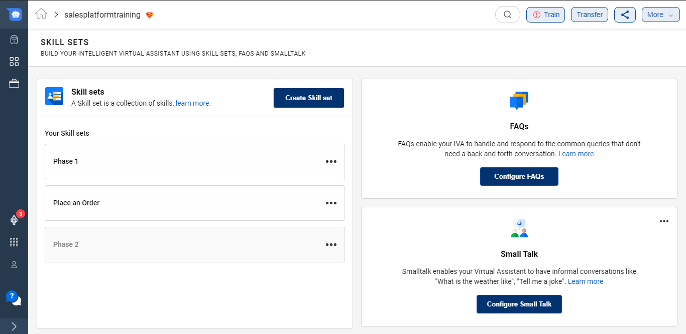

As you can see, there are three major sections -

1. Skill Set

2. FAQ Nodes

3. Small Talk

Conversation Studio allows you to build **Intelligent Virtual Assistants (IVA)s** which is equipped with various skills, handles FAQs and responds to casual conversations. **Skill Sets**, **FAQs** and **Small Talk** sections handle all these requirements respectively.

## Skill Set

A **Skill Set** is a collection of skills that enable your IVA to handle queries that need a complex conversational journey. These skills help the user to resolve their queries. A Skill Set aligns with the overall goals of the IVA.  

On Conversation Studio, a varied array of these skills are already present and are known as **Smart Skills**. You can read more about them [**here**](https://docs.haptik.ai/bot-builder/basic/smartskills).

### Create Skill Set

To add a new Skill Set to your IVA, click on **Create new Skill set** button. Provide a name to your skill set.

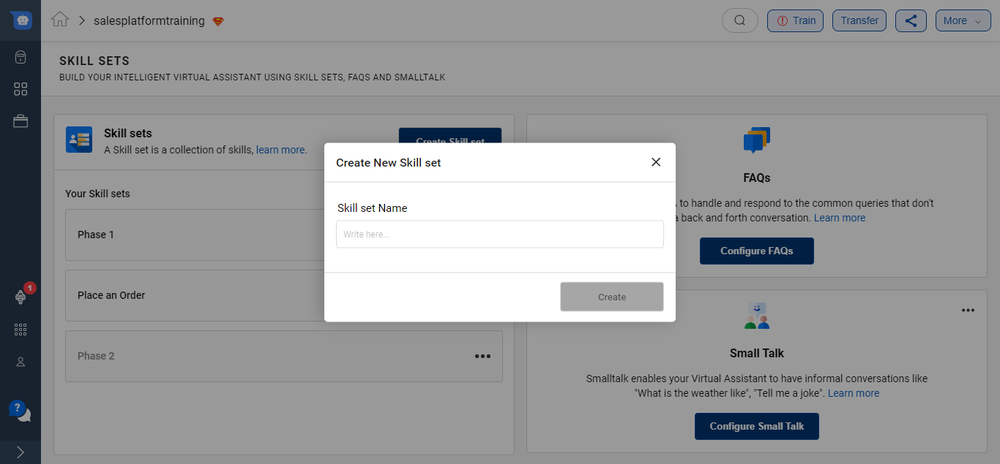

Once you give a name you will be able to see the following screen - 

### Use Smart Skills

<iframe width="560" height="315" src="https://www.youtube.com/embed/1sVrD9ZZTcI" title="YouTube video player" frameborder="0" allow="accelerometer; autoplay; clipboard-write; encrypted-media; gyroscope; picture-in-picture" allowfullscreen></iframe>

Click on the Skill Set to go inside and add skills to the respective skill set. **Skills are the smaller tasks that helps to accomplish the broader Skill sets.**

Click on the **+Add Skills** button to add required skills on the IVA. As soon as the button is clicked, a modal would open showcasing all skills available on the platform.

> **Smart Skills** are highly intelligent, pre-built conversational journeys.

These smart skills are available for specific industries like [**Ecommerce**](https://docs.haptik.ai/bot-builder/basic/ecommerce), [**Insurance**](https://docs.haptik.ai/bot-builder/basic/insurance) and [**Telecom**](https://docs.haptik.ai/bot-builder/basic/telecom). There are also few **Generic** ones which are most widely used in all IVAs.

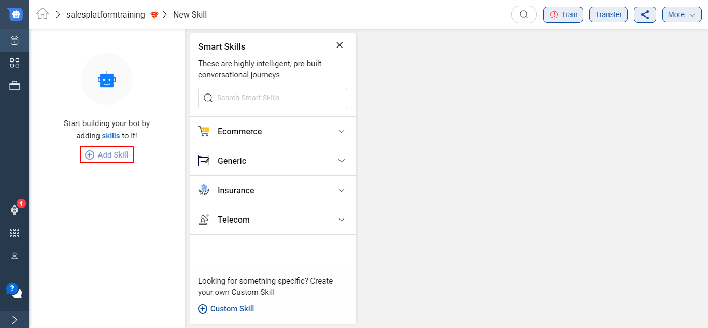

There is a **Search option** available to look for your desired Smart Skill as well.

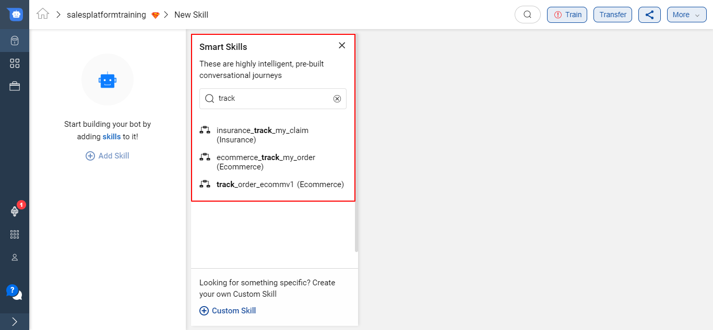

Once you click on any Smart Skill, a pop-up modal opens up which mentions all the details about the Smart Skill.

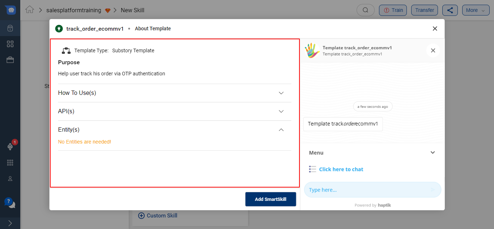

You can also test out the Smart Skill under the modal before using it in your IVA. This **preview and test option** helps to understand the capabilities of the skill in more detail.

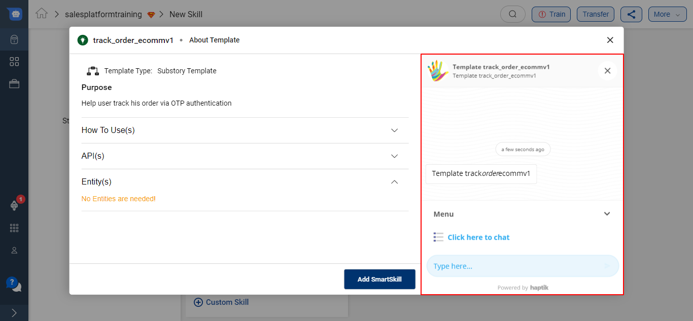

Once you have tested the Smart Skill and if it aligns with your use-case, go ahead and click on the **Add SmartSkill** button.

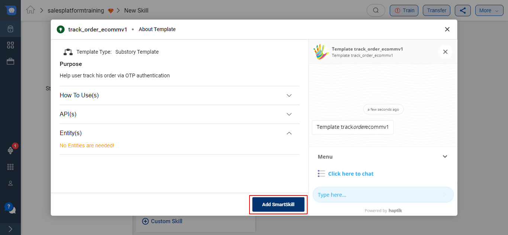

The entire Smart Skill will be imported on your IVA as shown below - 

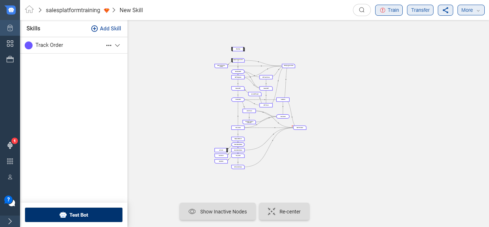

On the Left hand side, you will be able to see the list of all the Skills added on your IVA.

There are 4 options available for every Skill -

1. Deactivate Skill - This will deactivate the selected Skill and the IVA will no longer respond to user queries from this Skill.
2. Rename Skill - You can rename the selected Skill.
3. Copy Skill - This option will allow you to copy the entire Skill and paste it on any IVA.
4. Paste Node - This option will allow you to paste node that you copied from another Skill.

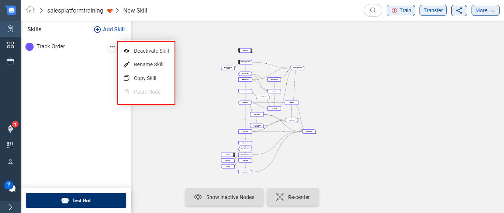

### Create a Custom Skill

If the Smart Skills available on the Conversation Studio are not aligning with your use-case, you can create a Custom Skill.

To add a Custom Skill, click on the **+ Custom Skill** button. This button would be at the bottom of the modal which opens up on the click of **+ Add Skill** button.

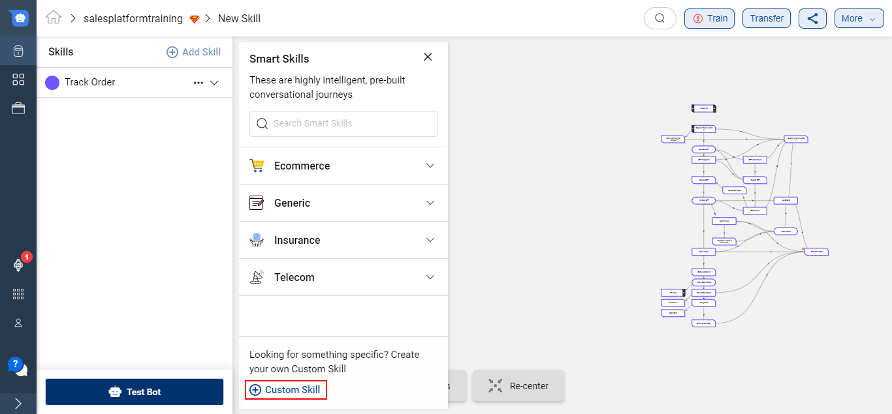

Provide the purpose of the skill i.e. name to your Custom Skill and click on the green tick

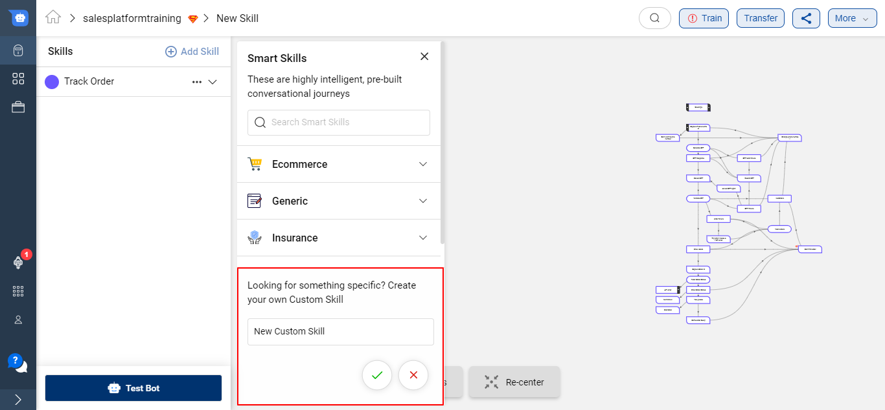

Once a new Skill is created successfully, you can start adding Nodes on the skill to start creating your conversational journey. To know more about Nodes, click [**here**](https://docs.haptik.ai/bot-builder/basic/creating-nodes).

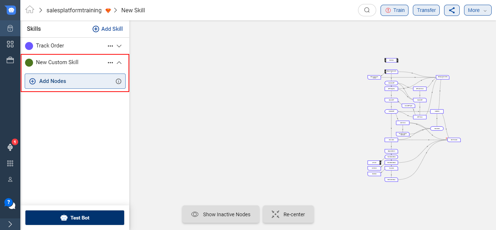

### Activate/Deactivate a Skill Set

If your Skill Set is no longer required on your IVA, you can simply deactivate it, as shown below -

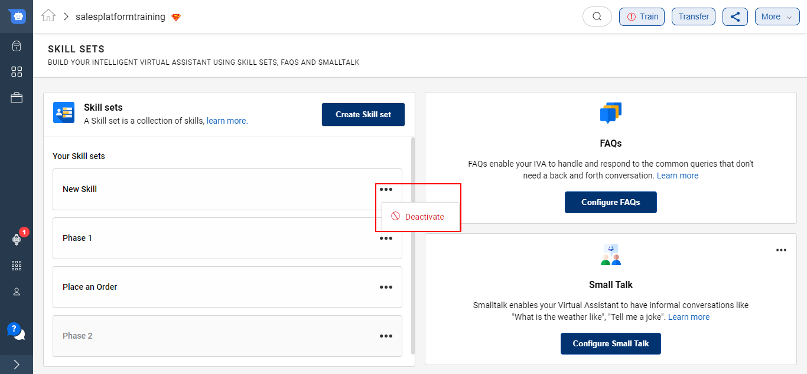

You can re-activate the Skill set as well

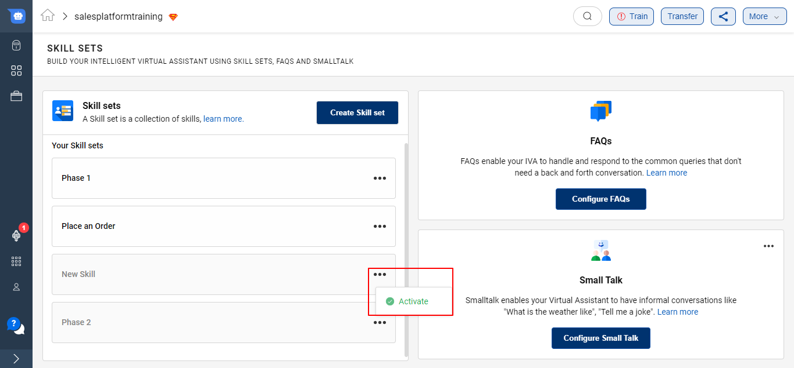

## FAQs

**FAQs section** enable your IVA to handle and respond to the common queries that don't need a back and forth conversation. You can either upload all FAQs at once using a CSV or add it one by one. To know more about FAQ Nodes, click [**here**](https://docs.haptik.ai/bot-builder/basic/general-nodes).

## Small Talk

**Smalltalk** is a plugin that enables your IVA to have informal conversations like "What is the weather like", "Tell me a joke". This plugin provides 99+ such conversational intents with their predefined responses. You can go ahead and tweak these responses suiting your brand and IVA. To know more about Small Talk, click [**here**](https://docs.haptik.ai/bot-builder/basic/smalltalk).

> You can follow the below video to create your first bot
>
> <iframe width="560" height="315" src="https://www.youtube.com/embed/8NbUvvX2gEY" frameborder="0" allow="accelerometer; autoplay; clipboard-write; encrypted-media; gyroscope; picture-in-picture" allowfullscreen></iframe>

