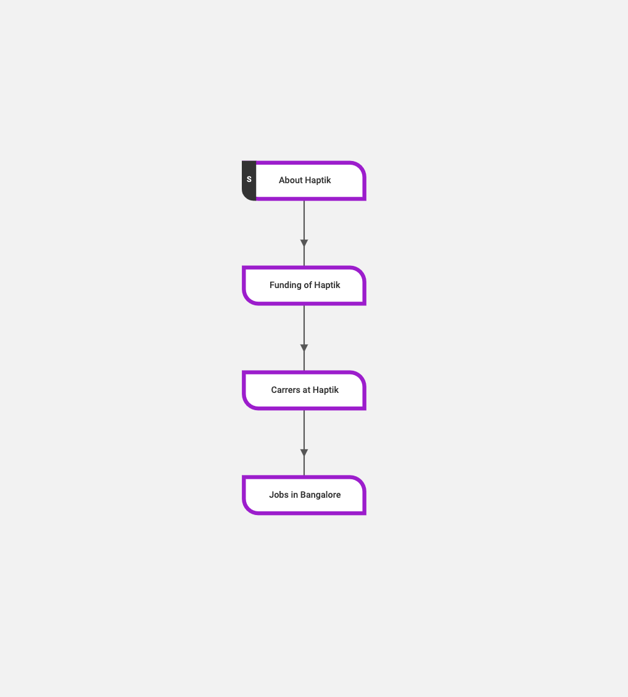

### Context Retention in an IVA

Context is linguistically defined as the background in which the conversation is taking place. From the IVA perspective, it can involve retaining the memory of any piece of information that has been either derived from past user behavior, the action performed by the IVA or has been explicitly given by the user.

It can involve information like Nodes traversed by the IVA in the conversation, Entity values collected, ML Module which sent the last reply e.g Disambiguation, Small Talk, etc.

User’s own name, email, phone number, etc explicitly provided by him, will also form a part of the context. The context needs to be stored before it can be used. Before we understand when the context is used, it’s important to know when it’s deleted.

**When is the context information deleted?** 

The context is deleted by the system in case of any of the following events -

* When a Context Clear Node is encountered by the IVA in the conversation

* When an agent marks the conversation as COMPLETE from Smart Agent Chat

**When is the context used?**
If the context has not been deleted as per the above 2 cases, the IVA can use the context up to 2 hours from the last activity of the user. The parameter of 2 hours is customizable up to 48 hours.

Illustration - Let’s say there is a conversation that ideally can get 4 levels deep as shown in the image below. It has a START node, a CHILD node, a Grand-Child node and a Great Grand-child Node with the Great Grand Child node being the Context Clear Node.

Let’s say the user starts the conversation from a Start Node ABOUT HAPTIK and then chooses an option to reach the child node FUNDING OF HAPTIK. At this point, if a user leaves the conversation, the IVA will retain the context for 2 hours since the no Context Clear Node has not been encountered in the conversation, so far.

So if a user comes back after, say e.g, 1.5 hours and taps a button or a Quick Reply on FUNDING OF HAPTIK node, he can reach the Grand-Child node i.e CAREERS AT HAPTIK Node directly.

**How does Chat Complete work?**
There are two types of CHAT COMPLETE - Hard Complete and Soft Complete.

SOFT COMPLETE occurs in the following cases when a user -

* Doesn’t reply to the query of a Human Assistant for 8 mins after a chat has been marked as “WAITING FOR USER” by the Assistant. It will also move the Chat from the “WAITING FOR USER” section to the “COMPLETED” section.

* Chats with the IVA and leaves, but doesn’t return within 8 mins.

In the above SOFT COMPLETE cases, the context is retained by the IVA for 2 hours. Again, the parameter of 2 hours is customizable per IVA basis, but most IVAs have kept it at 2 hours, which is the default value currently. The 2-hour limit can be extended to 48 hours as already mentioned.

HARD COMPLETE occurs when a conversation -

* Has encountered a Context Clear Node

* Has been marked as COMPLETE by the assistant from Smart Agent Chat.

The context is immediately deleted and is not retained even for 2 hours when such a HARD COMPLETE has been reached.
