A multilingual IVA i.e. a bot that can converse with users in multiple languages, can be a tremendous asset to any organization.

## Why do we need a multilingual bot?

IVAs enable you to interact with your customers in a smarter, faster, and more engaging way. And when equipped with the ability to converse in multiple languages, they enable your brand to overcome geographical and linguistic barriers to open up new markets and reach a wider audience.

All online businesses which sell their products/services to a large customer base across the globe need to integrate a multi-lingual bot as it empowers you with benefits like -

- Provides solution in users’ native language
- Increases geographical boundary reach
- Provides personalized customer experience 
- Enhances customer base
- Improves business ROI

## Multiple IVAs vs one IVA

Creating a whole new IVA for each native language isn’t feasible nor pocket-friendly. A single chatbot that can operate effectively in all the languages is what is needed! 

We believe it would not be feasible to develop a new chatbot for every new language to be added. Particularly since any changes made to the chatbot in one language needed to be implemented across all languages. Maintaining and updating the bot would be far more efficient if changes could be made to a single bot and applied across all the languages it supported.

Essentially, this means that when our multilingual chatbot switches from one language to another, the only things that change are the User Responses, Bot Responses, and Entities – the elements that are directly concerned with language. The rest of the underlying bot framework stays the same. A system like this makes it significantly easier to scale up the number of languages a bot can support over time.

## How do Haptik's multilingual bots function?

When user sends a message in a non-english language, our **Translation layer** helps our ML model understand user's intent and go to the desired node to fetch the response in the user's language. Our **Clean-up layer** on top of our translation layer help us to achieve the desired results.

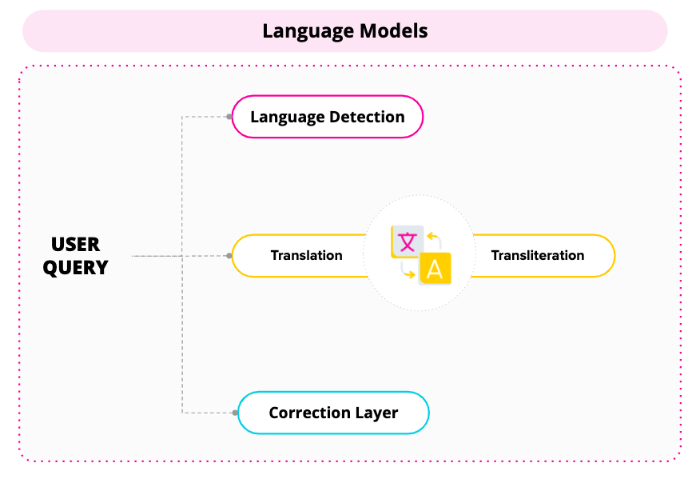

## How to create multilingual bots?

You would need to create an English bot to start with creation of multilingual bots. Below image sums up all the steps involved in taking a multilingual IVA live -

You can read through the defined steps below to understand the above image in more depth -

**Step 1** - Under Edit Bot, add languages of your wish from the drop down. You can add multiple languages at once. There is no restriction in adding any number of languages.

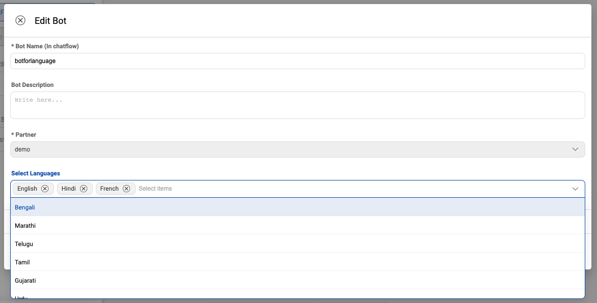

If you want a language not present in the list, get in touch with your Haptik SPOC to enable it for your IVA.

> Default language of an IVA is English. If you want to make a language other than English as default language for the bot, you can use **initialize-language** configuration while integrating your bot on the website. You can read more about it [**here**](https://docs.haptik.ai/web-sdk/configuration-customisation#initialize-language).

**Step 2** - Under a Node, provide **Bot Says** in the selected languages. 

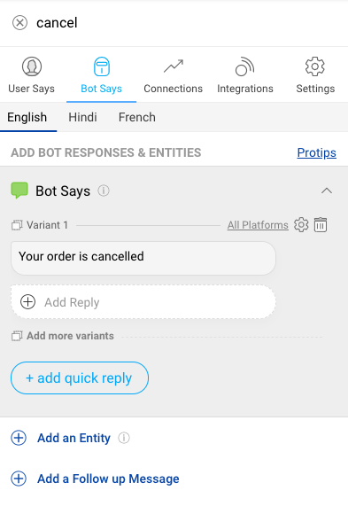

Bot Says in all the languages should be provided before hitting SAVE. Languages with empty Bot Says will have a **Red dot** on them for identification.

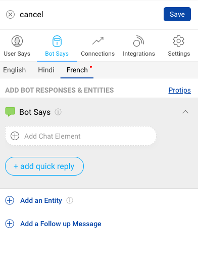
  
**Step 3** - Under entities, provide language specific responses and Final response. 

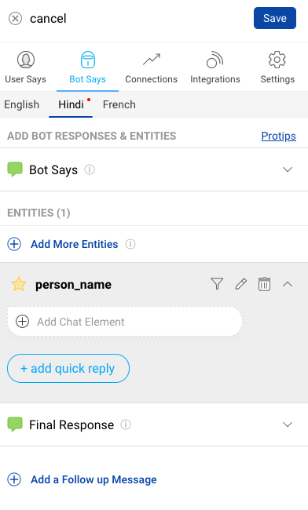

You can add language specific **Entity Reprompts** too.

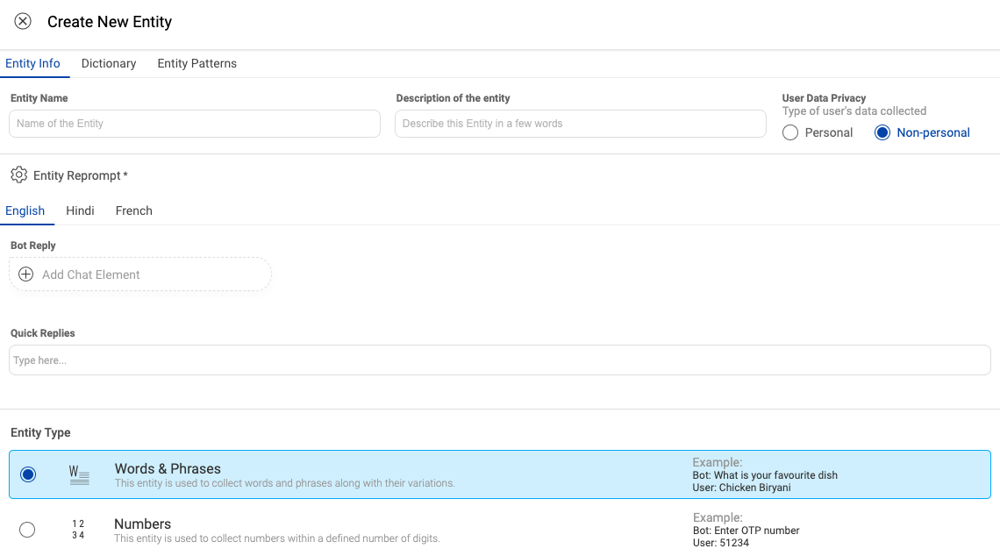
  
**Step 4** - Provide language specific **Follow up messages** (If required).

**Step 5** - On your Business, add the languages under General Settings. 

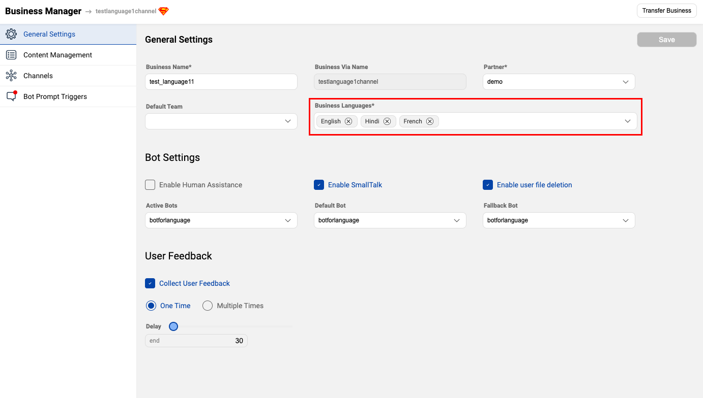

> Make sure to add the same languages at both the bot and the business. 

**Step 6** - On your Business, add the language specific Taskboxes and Bot Break Messages under Content Management.

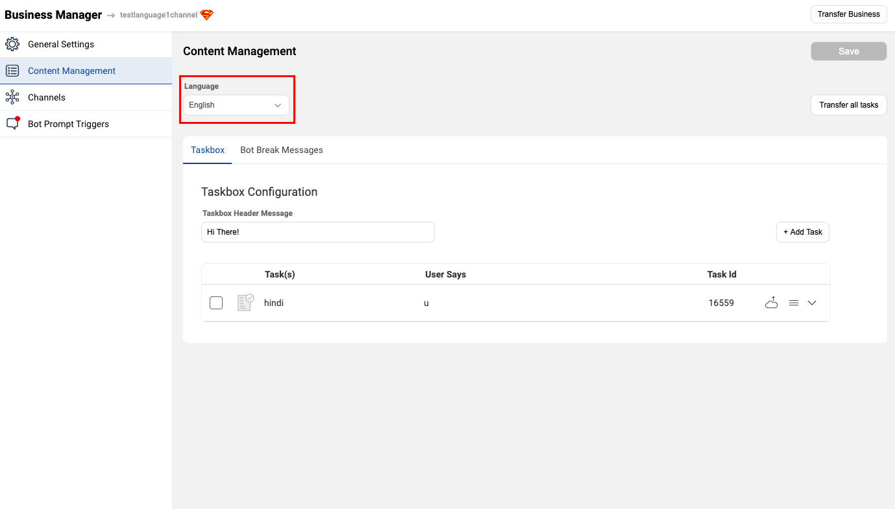
  
**Step 7** - You can also add language specific SDK configurations (If required).

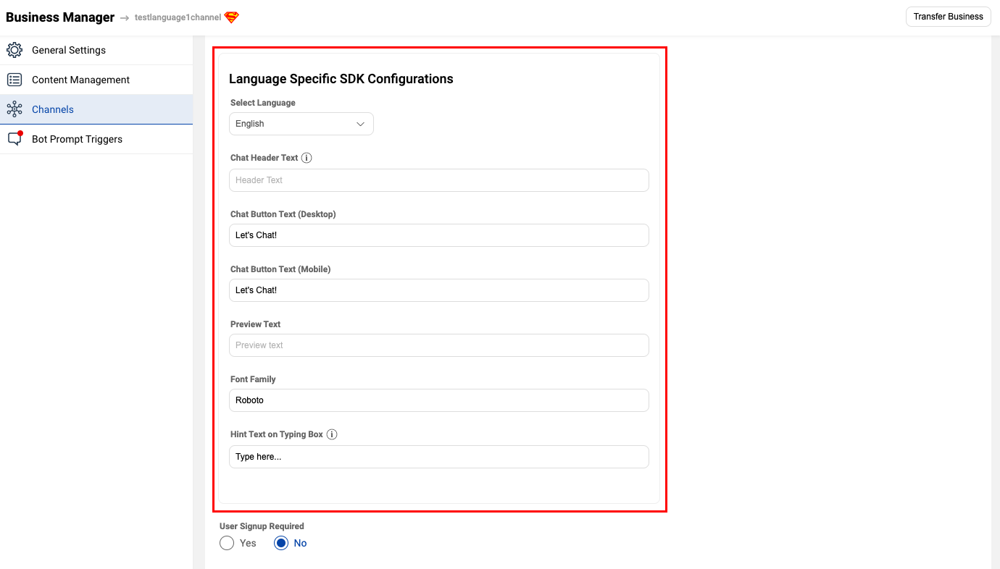

    FAQ Nodes and Small talk are currently not supported in multilingual bots.

### Glossary

For words which you need some specific translation values, you can use **Glossary** to improve the understanding of those domain specific terms and increase the overall accuracy. This can be done for all selected languages.

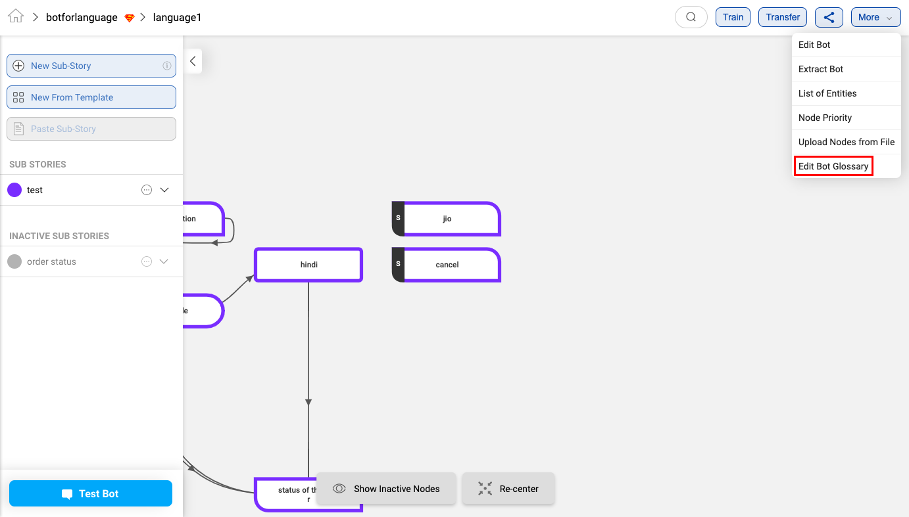
    
The Glossary CSV will help you provide the specific translations. You can download it and provide your own translations of those specific terms and upload it back.

  
CSV Format -

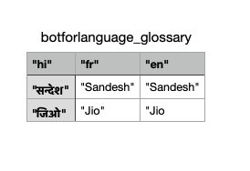

### Entity Support

All types of entities are supported for multilingual bots, there is no restriction in its usage. 

There is no need to add dictionaries in multiple languages.

You only need to add **Entity Reprompts** in all selected languages and if there are any domain specific words, they need to be added to the **Glossary**.

### Testing multilingual bots

You can use the same debugging window for testing multilingual bots. Both original and translated messages will be shown so that you can verify the cause of a particular node being selected. 

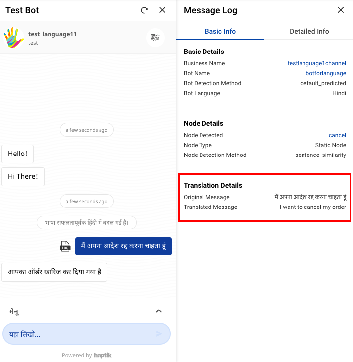

### Changing the language explicitly or Whatsapp multilingual bots

When the user explicitly mentions **I want to switch to Hindi language**, you can use the **Language switching template** to handle it. You can find the template under the Generic category inside the template menu. You can open the template menu by clicking on the New from Template button on the LHS menu of the Conversation Studio graph builder.

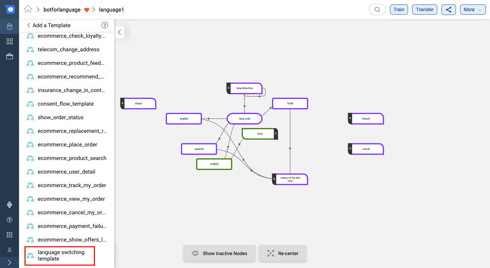

You can click on **Use template** to start using it.

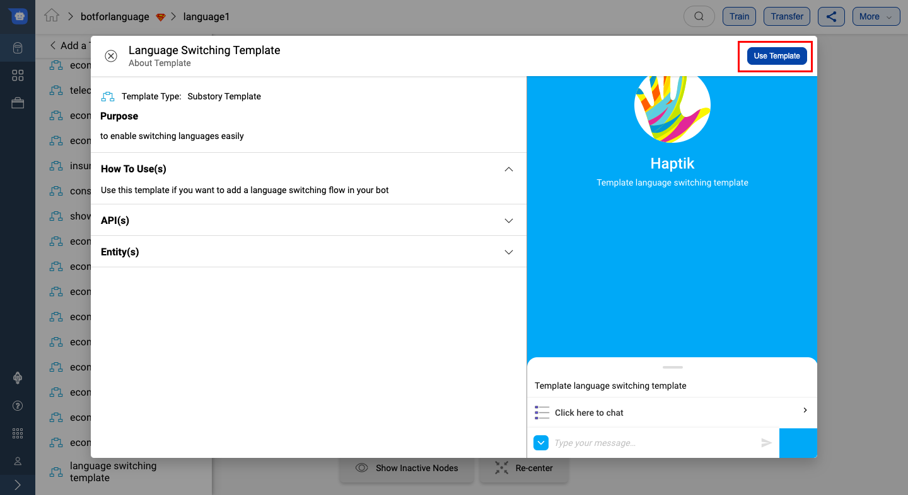

The template comes with a in-built logic and flow to switch between 10 languages. You can add the template to your bot and disable the languages that are not needed. It enables a user to switch language through the bot flow instead of using the UI.

Users can initiate the language change flow by saying something similar to "I want to change my language". Post this, the bot presents the users with options of which language to switch to.

### List of languages supported out of the box
**The SDK also supports the listed languages -**

- Hindi
- Marathi
- Bengali
- Oriya
- Urdu
- Gujarati
- Tamil
- Telugu
- Kannada
- Malayalam
- Punjabi
- French
- Dutch
- German
- Spanish

> System messages are not available for any other languages except the ones in the list. For any other languages, reach out to your Haptik SPOC.

## How do multilingual bots look?

This is how the multilingual bots look like

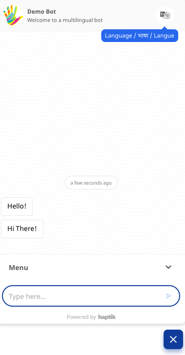

You can change the language of the bot as shown in the below image

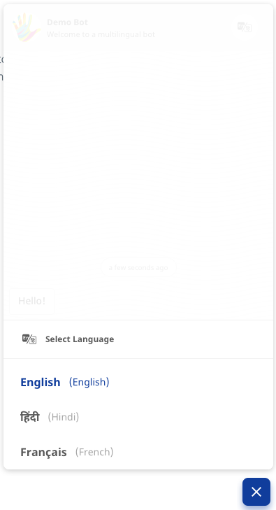

And you are ready, start having a conversation with the bot in your choice of language.
