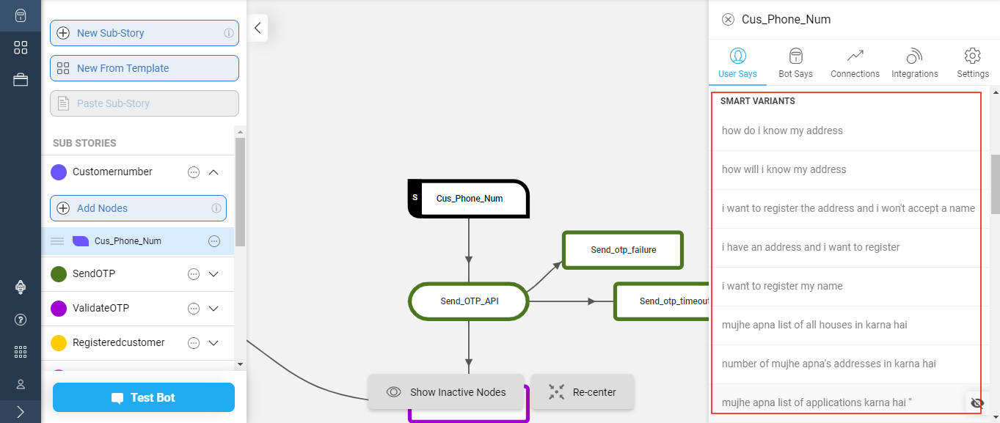
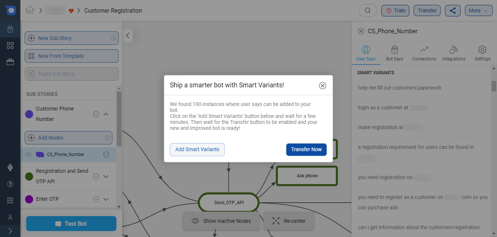
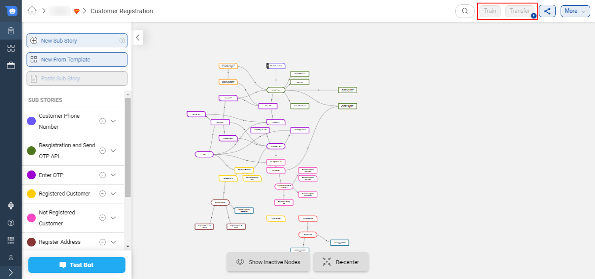
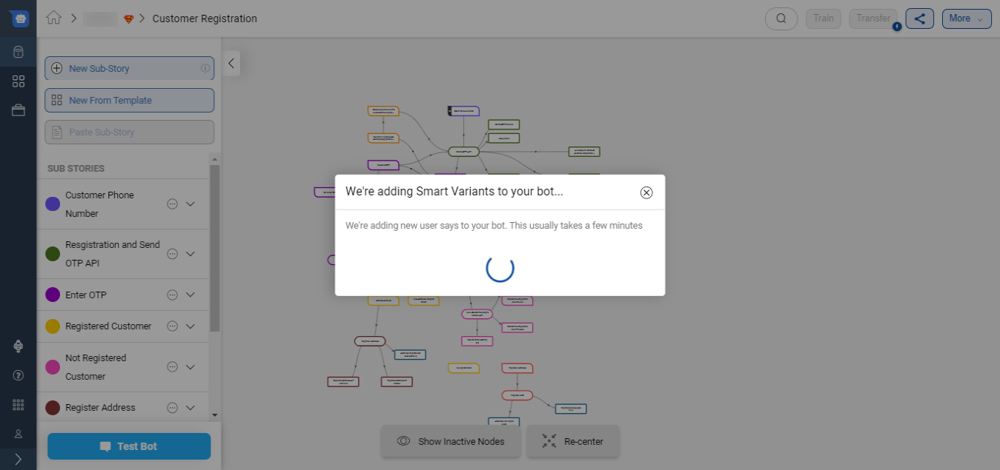

## Introduction

Each intent in an IVA is defined by a set of user messages. During training, the IVA creates an association between these user messages and its corresponding intent. Therefore, whenever (linguistically) similar messages are received from an actual user, they will now be attributed accurately to that specific intent.

Traditionally while an IVA was being built, a bot builder was expected to add at least 10 meaningful user messages for each intent. Now since one conversational flow contains multiple intents and multiple such conversational flows constitute one mature IVA, this activity of manually coming up with user says for each intent was thus not only time consuming, but cognitively exhausting as well. This collectively caused the overall quality of the user messages to suffer remarkably.

Smarts Variants help significantly reduce this development effort by automatically adding variants of user messages on a node by using complex Machine Learning models and thereby notably whittle down the total number of user messages the bot builder had to add manually. 

## What are Smart Variants?

Smart variants are automatically generated, linguistically similar variants of manually added user messages.

## How and when are Smart Variants added?

To add Smart Variants, simply click on the **Transfer** button on the top right corner of the bot screen.

> So that no ambiguous Smart Variants are generated between multiple intents, it is critical that the Smart Variants generation process is not triggered for each node in silo. The ideal way thus is to build the entire bot, then have the underlying AI go through all intents and subsequently add (non-ambiguous) Smart Variants to only applicable intents.
>
> It is therefore that the trigger for generating Smart Variants is integrated tightly with the end of the IVA building cycle (at least one cycle/phase), which is during **Transfer**.

Clicking on **Add Smart Variants** will disable the **Transfer** and **Train** buttons since the IVA is being trained for the newly added Smart Variants.

When you click on the small blue icon present on the disabled Transfer button, you can see the following popup on the screen

Once the IVA has been populated with all the Smart Variants, you will receive two emails.

1. The first email with the title **Smart Variants Generation for IVA complete!**

   This email contains the summary of the all added Smart Variants.
  
   On the same email, you will receive a CSV file with the name **augmentations.csv** which will have details of every Smart Variant added on the IVA with a corresponding link to its Node. 

  Here is a snippet of the email - 

> Note: You **do not** have to train the IVA separately after opting for *'Add Smart Variants'*.

2. The second email is the **Oracle feedback**. 

   This email helps Bot Builders discover methods by which an IVA can be improved and brought to a state where it is utilising capabilities of the ML Model to its maximum potential. You can read more about the Oracle Module [**here**](https://docs.haptik.ai/bot-builder/basic/oracle-feedback)

## How can I disable Smart Variants?

You can disable any particular Smart Variant added by the algorithm by clicking on the *disable button*.

Once the IVA development has been completed end-to-end and there are no more new Smart Variants to be added, on the click of the **Transfer** button you will get the below popup.

