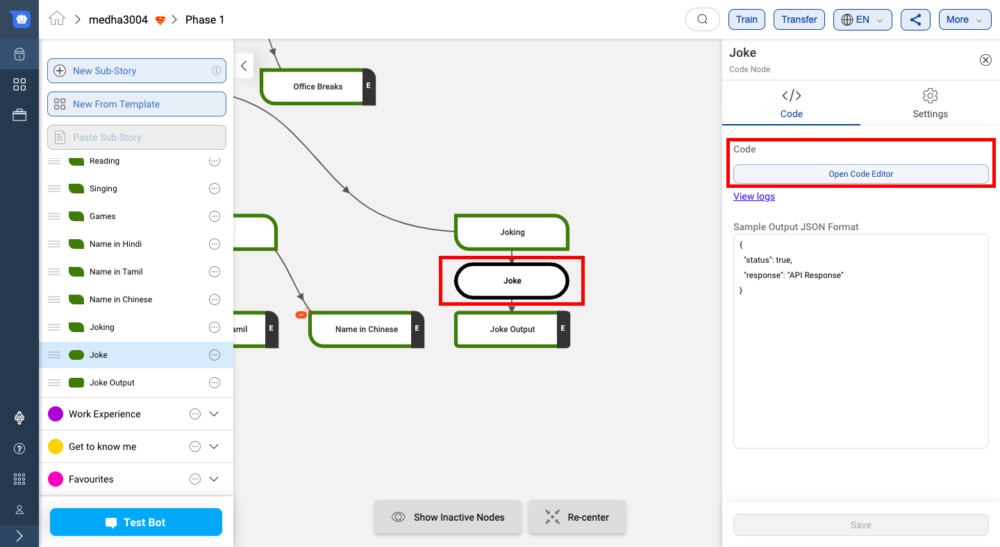

## What are Integrations

Integrations allow you to connect your IVA to external services to perform dynamic operations like fetching data, posting data or performing some business logic over the collected entities from the IVA.

## Types of Integrations

Haptik's Bot Builder tool supports two types of integrations. They are 

1) Integrations via Code Node using Code Editor
2) Integrations via Static Node using `Integrations Tab`

### Integrations via Code Node using Code Editor

Code Node provides an option of `Code Editor` where you can write your custom python code to communicate with the external service and execute the business logic.

You can read more about the Code Editor Integration [here](https://docs.haptik.ai/bot-builder/integrations/integrating-custom-code)

### Integrations via Static Node using `Integrations Tab`

Static Node provides as option of integrations. In this mode of integration, you provide an API URL to which the entity data will be passed as a POST request with a JSON payload. The API URL is then expected to return the bot response in a JSON format.

> You will see a red color **API** icon mark on top of Static Nodes which use this type of integration.

You can read more about it [here](https://docs.haptik.ai/bot-builder/integrations/integrating-apis)

## Choosing the type of Integration

It is important to choose the right type of integration for your use case as this will increase the speed of shipping the IVA and also help in long term maintainability.

### When to use Code Node

In most of the cases you should be using Code Node's Code Editor. Here are some sample scenarios:

* Integrating with APIs from external providers where they have their own request and response formats
  
* Performing business logic validations or calculations on the collected entities
  
* Posting or fetching data from external data stores or services

* OTP verification

### When to use Static Node integrations

This should only be used in very complex cases where a middleware service needs to be built or the code is too complicated. Some scenarios where you should be using the API integrations are:

* Having Custom authentication and data storage requirements

* Integrating with APIs from external providers where they understand Haptik's request and response formats
