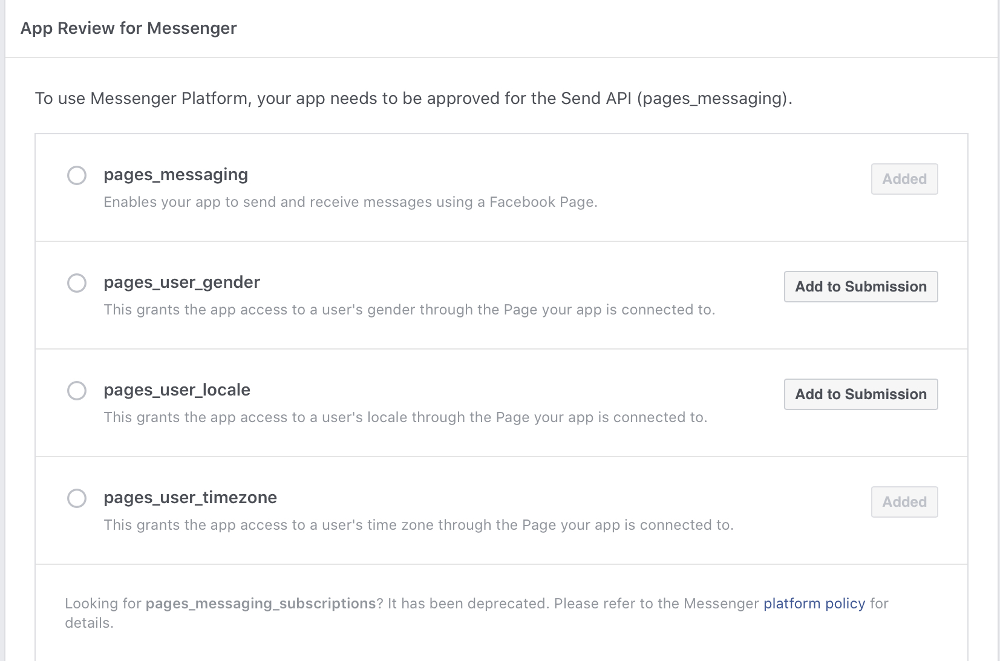
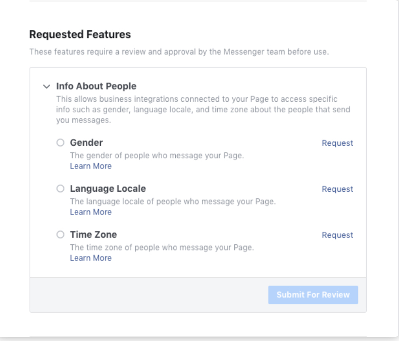

## Pre-requisites

- **A Facebook page** on which you wish to display the bot/app. If you do not have one, the complete details on how to create a facebook page can be found online by clicking [here](https://www.facebook.com/pages/create/)

- **Access token** generated for the above page. Either you can generate it if you are the administrator of that page. If not, the client will have to generate and provide you with the access token _(refer Step 3)_.

- **The bot** should be ready and you should have access to its _Business Manager._

## Step 1: Creating a Facebook App and adding Messenger to it

- Head to [Facebook for developers.](https://developers.facebook.com)

- Login using your Facebook account.

  - If you have never used a developer account before, click on **Get started**. Follow through the steps presented on the screen and then click on **Create your first app**.

  - If you have already used this developer account before, click **Create App**.

- Enter the _display name_ for this new facebook app and your _email id._

- Click **Create App ID**. This creates a new _(empty)_ Facebook app and you can now add different Facebook products to this app in order to connect to them.

- Find **Messenger** in the list of products and click **Setup**.

## Step 2: Add the client as an administrator to the app:

- To do this, we need the _Facebook_id/username_ of the client's administrator account which is used to manage their Facebook page.

  - To get the _Facebook_id_, go over to Facebook, search and find this account which is the administrator for the Client's Facebook Page.

  - Click to view the _profile_ of this account.

  - Now check the URL in the browser to get the _Facebook_id_. For example, if the URL in the browser is `https://facebook.com/demo.account.166452` then  the _Facebook_id_ of this account is `demo.account.166452`.

- Add the client as an administrator using the _Facebook_id_.

  - Open your newly created app _(in Facebook for developers)_.

  - Click **Roles**.  

  - Add the client's _Facebook_id_ to the _Administrators_ section by clicking on **Add Administrators**, pasting the _Facebook_id_ in the text box that shows up on the screen and then clicking on **Submit**.

## Step 3: Adding the Facebook page to the app and generating _access token_:

- We need to add the Facebook page _(to which we want to connect our bot)_ to `our facebook app -> Messenger`. Only once that this page has been added can the _access token_ for it be generated.

- We need this access token while we configure our Business in _Bot Builder_

  >Please note that the following steps can only be performed if you are the administrator of the Client's Facebook Page.   
  >If not, then:
  >- You would either have to request the client to give you that access.  
  >- Or alternatively, the client would themselves have to add the page to the app following these steps and subsequently generate and share the _access token_

- Open our app in Facebook for developers.

- Go to `Messenger -> Settings`.

- Look for the **Access Tokens** section and click:

  - **Add or Remove Pages** if the page has already been created.

  - **Create New Page** to create the page if you have not created it yet.

- Now select the page which you would like to add to the app and click **continue**.

- After the page has been successfully added to the app, click **Generate Token** to create the _access token_.

  > Please note:
  >- Ask the client to **save** this _access token_ and **not to re-generate the token** as generating a new token will immediately invalidate the previously generated _access token_.  
  >- If your app is in _development mode_, you can still generate a token but will only be able to access those Facebook users who either manage the app or the Facebook page

## Step 4: Setting up the _Bot Builder_:

- Get the App Secret:
  - `Facebook for developers -> (our app) -> settings -> basic`

  - Find the field titled **App Secret** and click on **Show**

  - Copy the value in this field and paste it in a note or someplace safe and keep it handy since we would need it while going through the next steps.

- Now go to `Bot Builder -> Business Manager -> _(the business in question)_ -> Partner Specific -> Platform Deployments -> Facebook`.

- Paste the App Secret we just copied into the **app_secret_key** field.   

- Paste the _access token_ generated in _Step 3_ into the field **access_token**.

- Now for the field **secret_challenge_key**, put any text value that you deem proper or you can even use [RandomKeyGen](https://randomkeygen.com/ "The Secured Password & Keygen Generator"). Whatever value we enter here will be used in the next steps when we jump back to setting up webhooks on our Facebook app.

- **callback_url** set it as `fb/business_name`. For example, `fb/mydemobusiness` _(assuming that the business name is mydemobusiness)_. Do note that whatever value we enter here has to be a _URL safe string_.

- Enable the button on the _top right_ side to activate all of these deployment keys.

## Step 5: Setting up webhook on Facebook App:

- This step connects our Facebook App with our Bot Builder.

- Go to `Facebook for developers -> (our app) -> Messenger -> Settings`

- Find the section titled **Webhooks**.

- Click on **Add Callback URL**.

- Enter the following URL into the **Callback URL** field:

  - > Callback URL = (Environment's base URL) + (callback_url entered in the Bot Builder)

  - _Staging_ - `<base url for staging message delivery>/<callback_url entered in Bot Builder>`. Thus, following our example, our complete Callback URL would be `<baseurl_staging>/fb/mydemobusiness`.

  - _Production_ - `<base url for production message delivery>/<callback_url entered in Bot Builder>`. Thus, following our example, our complete Callback URL would be `<baseurl_production>/fb/mydemobusiness`.

- Add the **secret_challenge_key** entered in Bot Builder, into the **Verify Token** field.

- Click **Verify and Save**. Facebook will now make a call to the Callback URL entered and send the Verify Token along with it and only on successful verification, save it.

- Now that the Callback URL has been verified and saved, we need to _subscribe_ to _Messenger events_ that would occur on our Facebook Page and for which our Callback URL would subsequently be called. To do this, click on **Add Subscriptions**.

- A popup window appears showing a grid of available events to which we can subscribe. Select all the relevant events. Minimally, atleast these 4 events should be subscribed to:
  1. messages
  2. messaging_postbacks
  3. message_deliveries
  4. message_reads

- Click **Save**.

## Step 6: Enabling our Facebook App to be the Primary receiver on the Facebook Page:

- For the Facebook Page on which we wish to deploy our bot, we need to set our app as the Primary Receiver.

- Go to `Facebook -> client's Facebook Page -> Settings -> Advanced Messaging`.

- Scroll down to the **App Settings** section and click on **Configure**.

- In the popup window that shows up, select the drop down besides the label **Primary receiver for handover protocol** and from this drop down, select our app.

- Close the window. The setting has been saved.

> By this point, if everything has been setup properly:
  >- go to `Facebook for developers -> (our app)`.  
  >- Under **PRODUCTS**, there should be a green tick mark besides **Webhooks** and **Messenger** respectively.

## Facebook Verifications

For certain permissions, we need verifications from Facebook. There are three components involved in the verification process:

  1. pages_messages permission:

      - Pages_messages enables your app to send and receive messages using a Facebook Page.

      - Facebook Messenger review team manually verifies your bot and gives permission accordingly.

      - Refer to this Facebook Documentation to learn more - [Submitting your Messenger Bot](https://developers.facebook.com/docs/messenger-platform/app-review/).

      - > When you share your bot for permission, there is a testing freeze. No one can test the bot on the facebook page.
 
  2. pages_user_timezone permission:

      - Timezone of a user is required to greet the user appropriately
          - For ex: If the user greets the bot "Good Morning", the bot will greet back the user based in user's timezone 
      
      - pages_user_timezone grants your app access to user's timezone through the page your app is connected to
      
        
      
      - This permission needs to be requested on Page Level as well
          - Go to client's Facebook Page -> Settings -> Advanced Messaging -> Under Info About People -> Select the "Time Zone" field -> click the "Request" button
       
            

      - Facebook Messenger review team manually verifies your bot and gives permission accordingly.

      - Refer to this Facebook Documentation to learn more - [Submitting your Messenger Bot](https://developers.facebook.com/docs/messenger-platform/app-review/).

      - > When you share your bot for permission, there is a testing freeze. No one can test the bot on the facebook page.

  3. Business Verification:

      - Facebook Business Verification is required to take the app public.

      - Refer to Facebook Documentation to learn more - [Submitting your Messenger Bot](https://developers.facebook.com/docs/messenger-platform/app-review/).

## Setting up get started button

Use this cURL request to setup a get started button

> curl --location --request POST https://graph.facebook.com/v4.0/me/messenger_profile?access_token=<Access Token\>
header 'Content-Type: application/json' \ & data-raw
{
  "get_started":{
    "payload":"<Text to show\>"
  }
}
  
Replace: 
<Access Token\> : Add your Access token stored previously in Bot Builder. 
<Text to show\> : Text you wish to show up on get started button.

## Setting up a persistent menu

Use this cURL request to setup a taskbox

> curl --location --request POST https://graph.facebook.com/v4.0/me/messenger_profile?access_token=<Access token\>
header 'Content-Type: application/json' \ & data-raw
{
    "persistent_menu": [
        {
             "locale": "default",
            "composer_input_disabled": false,
            "call_to_actions": [
                {
                    "type": "postback",
                    "title": "Menu item 1",
                    "payload": "Menu item 1 {task}"
                },
                {
                    "type": "postback",
                    "title": "Menu item 2",
                    "payload": "Menu item 2 {task}"
                }
            ]
        }
    ]
}
  
Replace: 
<Access Token\> : Add your Access token stored previously in Bot Builder. 
